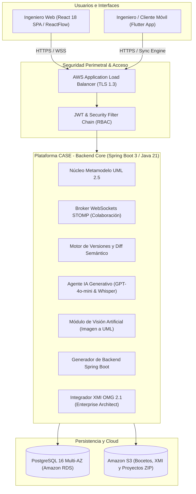
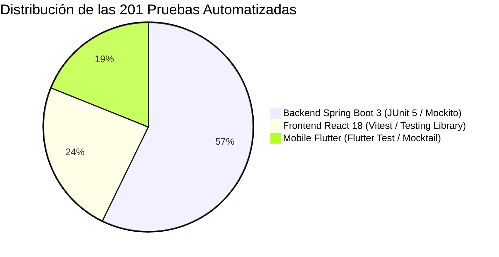

# ESPECIFICACIÓN DE ALCANCES DEL PROYECTO POR MÓDULOS

> **Plataforma CASE Colaborativa Inteligente para Diseño UML y Generación Automática de Software**  
> **Asignatura:** Software 1 — Primer Parcial  
> **Estado:** Implementado y Verificado (13 Módulos Completos)  
> **Versión del Documento:** 1.0.0  
> **Ubicación Oficial en Documentación:** [`documentation/requirements/ALCANCES_DEL_PROYECTO.md`](documentation/requirements/ALCANCES_DEL_PROYECTO.md)

---

## 1. Resumen Ejecutivo y Visión General del Sistema

La **Plataforma CASE Colaborativa Inteligente** es un entorno de ingeniería de software de última generación concebido para resolver las limitaciones de las herramientas de modelado tradicionales (como Enterprise Architect o StarUML) cuando se opera en equipos distribuidos y bajo paradigmas de desarrollo ágil y asistido por Inteligencia Artificial.

El sistema integra:
1. **Modelado Visual UML 2.5** de clases y relaciones con una experiencia interactiva fluida.
2. **Colaboración síncrona en tiempo real** mediante WebSockets y difusión atómica de cambios.
3. **Asistencia inteligente multimodal** (texto y voz) con Large Language Models y Visión Artificial para digitalizar bocetos y pizarras físicas.
4. **Generación automática forward engineering** de proyectos backend completos en Java 21 y Spring Boot 3 con persistencia, APIs REST y documentación OpenAPI.
5. **Interoperabilidad bidireccional estándar** con la industria mediante OMG XMI 2.1.
6. **Ecosistema móvil multiplataforma (Flutter)** con arquitectura *offline-first*, sincronización transaccional y asistente IA on-device.
7. **Infraestructura Cloud-Native en AWS** con Terraform IaC, ECS Fargate, RDS PostgreSQL Multi-AZ y seguridad perimetral de grado empresarial.

---

## 2. Mapa General de Módulos del Sistema

| Código | Módulo | Fase | Enfoque Arquitectónico |
| :--- | :--- | :--- | :--- |
| **MOD-01** | Arquitectura Base, Entornos y Orquestación | Fase 1 | Configuración Multi-módulo, CI/CD base, Dockerfiles y DDL |
| **MOD-02** | Identidad, Autenticación y Control de Acceso (IAM & RBAC) | Fase 2 | Spring Security 6, JWT HMAC-SHA256, BCrypt, Roles y Auditoría |
| **MOD-03** | Núcleo del Metamodelo UML 2.5 (UML Core Engine) | Fase 3 | Dominio conceptual de clases, atributos, métodos y relaciones |
| **MOD-04** | Editor Visual Interactivo Web (Visual UML Canvas) | Fase 4 | React 18, ReactFlow 11, TypeScript, nodos personalizados |
| **MOD-05** | Colaboración en Tiempo Real y Presencia Concurrente | Fase 5 | WebSockets STOMP sobre SockJS, presencia y eventos atómicos |
| **MOD-06** | Control de Versiones, Historial y Auditoría Semántica | Fase 6 | Snapshots inmutables, Diff semántico y Rollback transaccional |
| **MOD-07** | Asistente con Inteligencia Artificial Generativa (AI Agent) | Fase 7 | LLM OpenAI GPT-4o-mini / Whisper, comandos texto/voz |
| **MOD-08** | Visión Artificial y Reconocimiento de Bocetos (Image to UML) | Fase 8 | Procesamiento geométrico, OCR y reconstrucción de grafos UML |
| **MOD-09** | Generación Automática de Software Backend Spring Boot | Fase 9 | Forward engineering, FreeMarker, empaquetado ZIP en memoria |
| **MOD-10** | Interoperabilidad e Integración XMI (Enterprise Architect) | Fase 10 | Serializador/Parser bidireccional XML conforme a OMG XMI 2.1 |
| **MOD-11** | Ecosistema Móvil Multiplataforma (Flutter Mobile App) | Fase 11 | Flutter 3.24+, Clean Architecture, catálogo y consumo REST |
| **MOD-12** | Motor Offline, Sincronización y Asistente IA Local | Fase 12 | SQLite local, cola FIFO, Last-Write-Wins e IA On-Device |
| **MOD-13** | Infraestructura Cloud AWS, DevOps y Seguridad Perimetral | Fase 13 | Terraform IaC, ECS Fargate, RDS, S3, ALB, GitHub Actions |

---

## 3. Desglose Exhaustivo de Alcances por Módulo

---

### Módulo 1: Arquitectura Base, Entornos y Orquestación (MOD-01)
*Fase Asociada: Fase 1 — Preparación del proyecto y configuración de ambientes.*

#### Objetivo
Establecer la estructura fundacional del repositorio mono-repo multi-módulo, los estándares de codificación, la base de datos relacional y los scripts de automatización para ejecución local y desarrollo estandarizado.

#### Alcance Funcional Incluido (In-Scope)
- Creación de la estructura del repositorio dividida en: `backend/`, `frontend/`, `mobile/`, `database/`, `documentation/` e `infrastructure/`.
- Configuración de dependencias Maven para Java 21 LTS y Spring Boot 3.3.4.
- Inicialización del proyecto Frontend con React 18.3, TypeScript 5.6 y bundler Vite 5.4.
- Estructuración de la aplicación móvil en Flutter 3.24.5 con Dart 3.5.4.
- Creación del script DDL `database/init.sql` para PostgreSQL 16 con extensión `uuid-ossp` y tablas iniciales.
- Scripts de automatización de arranque local en lote: `iniciar-proyecto.bat`, `start-all.bat`, `start-backend.bat`, `start-frontend.bat` y `start-mobile.bat`.
- Configuración de linters y formateadores: Checkstyle para Java, ESLint y Prettier para Frontend, `analysis_options.yaml` para Flutter.
- Gestión segura de secretos mediante plantillas `.env` y `.env.example`.

#### Fuera de Alcance (Out-of-Scope)
- No incluye lógica de negocio ni persistencia de entidades específicas de UML.
- No incluye despliegues a entornos productivos de nube en esta fase.

#### Componentes Técnicos Involucrados
- `software-case-platform/backend/pom.xml`
- `software-case-platform/backend/src/main/resources/application.yml`
- `software-case-platform/frontend/package.json`, `vite.config.ts`, `tsconfig.json`
- `software-case-platform/mobile/pubspec.yaml`, `analysis_options.yaml`
- `software-case-platform/database/init.sql`
- `iniciar-proyecto.bat` y scripts en `software-case-platform/scripts/`

#### Requerimientos Asociados
- **RNF-05** (Interoperabilidad y estándares abiertos).
- **RNF-06** (Mantenibilidad y código limpio).

---

### Módulo 2: Identidad, Autenticación y Control de Acceso (MOD-02)
*Fase Asociada: Fase 2 — Sistema de usuarios, autenticación y seguridad base.*

#### Objetivo
Proveer un sistema robusto de gestión de identidades (IAM) y control de acceso basado en roles (RBAC) para salvaguardar todos los recursos de la plataforma CASE.

#### Alcance Funcional Incluido (In-Scope)
- Registro de nuevos ingenieros y usuarios del sistema con validación de correo electrónico único.
- Autenticación con credenciales (email y contraseña) mediante tokens **JWT (JSON Web Tokens)** firmados con algoritmo HMAC-SHA256.
- Almacenamiento seguro de credenciales con hashing unidireccional y salting mediante **BCrypt** (cost factor 10+).
- Control de acceso por roles (RBAC):
  - `ROLE_ADMIN`: Gestión global de usuarios, auditoría del sistema y configuraciones.
  - `ROLE_INGENIERO`: Creación y edición de proyectos, diagramas UML, generación de código y uso de IA.
- Filtro de seguridad stateless `JwtAuthenticationFilter` en la cadena de filtros de Spring Security 6.
- Manejo centralizado de excepciones de seguridad con respuestas uniformes HTTP 401 (No Autorizado) y HTTP 403 (Prohibido).
- Controlador de autenticación con endpoints `/api/v1/auth/register`, `/api/v1/auth/login` y `/api/v1/auth/me`.
- Interceptor en frontend con Axios para inyección automática del encabezado `Authorization: Bearer <token>` y redirección al login ante tokens expirados.

#### Fuera de Alcance (Out-of-Scope)
- Autenticación federada mediante OAuth2 social (Google, GitHub) en esta versión.
- Autenticación biométrica o MFA (Multi-Factor Authentication) por SMS/TOTP.

#### Componentes Técnicos Involucrados
- `com.caseplatform.security.*` (`JwtTokenProvider`, `JwtAuthenticationFilter`, `SecurityConfig`, `CustomUserDetailsService`)
- `com.caseplatform.model.User`, `com.caseplatform.model.Role`
- `com.caseplatform.repository.UserRepository`
- `com.caseplatform.controller.AuthController`
- `frontend/src/services/apiClient.ts`, `frontend/src/pages/LoginPage.tsx`

#### Requerimientos Asociados
- **RF-01** (Autenticación y Seguridad).
- **RNF-01** (Seguridad y cifrado).

---

### Módulo 3: Núcleo del Metamodelo UML 2.5 (MOD-03)
*Fase Asociada: Fase 3 — Desarrollo del núcleo UML 2.5 y modelo conceptual.*

#### Objetivo
Implementar en el backend el metamodelo formal conforme al estándar **OMG UML 2.5**, capaz de representar proyectos, diagramas de clases, atributos, operaciones y relaciones estructurales de forma íntegra y persistente.

#### Alcance Funcional Incluido (In-Scope)
- Entidad `Project` con metadatos de autoría, fecha de creación y descripción.
- Entidad `Diagram` para clasificar diagramas conceptuales de clases asociados a un proyecto.
- Entidad `UmlClass`: nombre de la clase, visibilidad (`PUBLIC`, `PACKAGE`), modificadores (`isAbstract`), posición visual en el lienzo (`positionX`, `positionY`) y estereotipos (`<<entity>>`, `<<service>>`, etc.).
- Entidad `UmlAttribute`: nombre, tipo de dato primitivo o referencial (`String`, `Integer`, `Long`, `Boolean`, `Double`, `LocalDate`, custom), visibilidad (`+` Public, `-` Private, `#` Protected, `~` Package), valor por defecto, modificadores `isStatic` e `isFinal`.
- Entidad `UmlMethod`: nombre, tipo de retorno, visibilidad, parámetros formales tipados, modificadores `isStatic` e `isAbstract`.
- Entidad `UmlRelationship`: conexión entre clase origen y destino con los 5 tipos oficiales del estándar UML:
  - `ASSOCIATION` (Asociación simple / bidireccional)
  - `AGGREGATION` (Agregación débil — rombo blanco)
  - `COMPOSITION` (Composición fuerte — rombo negro)
  - `GENERALIZATION` (Herencia / Especialización — triángulo hueco)
  - `DEPENDENCY` (Dependencia / Uso — flecha punteada)
- Soporte para multiplicidades en ambos extremos (`0..1`, `1`, `*`, `1..*`, `0..*`) y nombres de roles.
- Validación de reglas de integridad: no duplicación de clases por diagrama, no recursión inválida en herencias cíclicas.
- Endpoints REST completos (CRUD) para proyectos, diagramas, clases, métodos, atributos y relaciones.

#### Fuera de Alcance (Out-of-Scope)
- Diagramas de comportamiento (Secuencia, Estados, Actividades) o de estructura física (Componentes, Despliegue) dentro del metamodelo en esta fase.

#### Componentes Técnicos Involucrados
- `com.caseplatform.model.*` (`Project`, `Diagram`, `UmlClass`, `UmlAttribute`, `UmlMethod`, `UmlRelationship`, `VisibilityType`, `RelationshipType`)
- `com.caseplatform.repository.*`
- `com.caseplatform.service.UmlModelService`, `com.caseplatform.service.ProjectService`
- `com.caseplatform.controller.UmlModelController`, `com.caseplatform.controller.ProjectController`

#### Requerimientos Asociados
- **RF-02** (Núcleo UML 2.5).
- **RNF-05** (Interoperabilidad y estándar OMG).

---

### Módulo 4: Editor Visual Interactivo Web (MOD-04)
*Fase Asociada: Fase 4 — Desarrollo del editor visual UML 2.5 colaborativo base.*

#### Objetivo
Proveer una interfaz de usuario web de alto rendimiento basada en React y ReactFlow que emule la experiencia de diseño visual de herramientas profesionales tipo Enterprise Architect directamente en el navegador.

#### Alcance Funcional Incluido (In-Scope)
- Lienzo infinito interactivo con capacidades de pan (desplazamiento) y zoom (acercamiento/alejamiento) mediante gestos de ratón o atajos de teclado.
- Nodos personalizados UML de 3 compartimentos (Header con estereotipo y nombre, Compartimento de Atributos con iconos de visibilidad, Compartimento de Métodos con firmas tipadas).
- Arrastre interactivo (*drag-and-drop*) de clases con actualización reactiva de coordenadas.
- Conexión visual magnética mediante aristas (*edges*) personalizadas con marcadores SVG según el tipo de relación (rombos rellenos/vacíos, triángulos de herencia y líneas punteadas).
- Panel de propiedades lateral reactivo para edición en caliente de nombre de clase, visibilidad, adición/edición/eliminación de atributos y métodos.
- Barra de herramientas flotante con acciones rápidas: creación de clases, alineación, exportación gráfica en formatos vectoriales y rasterizados (SVG y PNG).
- Soporte de atajos de teclado (Delete/Backspace para eliminar elementos, Ctrl+Z / Ctrl+Y para historial local de lienzo).

#### Fuera de Alcance (Out-of-Scope)
- Edición 3D o realidad aumentada en el lienzo.
- Soporte de renderizado visual para diagramas no-UML (BPMN, diagramas de flujo libres).

#### Componentes Técnicos Involucrados
- `frontend/src/features/uml-editor/components/*` (`UmlCanvas.tsx`, `UmlClassNode.tsx`, `UmlRelationshipEdge.tsx`, `PropertiesPanel.tsx`, `Toolbar.tsx`)
- `frontend/src/features/uml-editor/hooks/useUmlEditor.ts`
- `frontend/src/pages/UMLEditorPage.tsx`

#### Requerimientos Asociados
- **RF-03** (Editor Visual Web).
- **RNF-02** (Rendimiento y tiempos de carga menores a 1.5s).

---

### Módulo 5: Colaboración en Tiempo Real y Presencia (MOD-05)
*Fase Asociada: Fase 5 — Implementación del sistema colaborativo en tiempo real.*

#### Objetivo
Habilitar la edición concurrente y simultánea sobre el mismo diagrama UML por parte de múltiples ingenieros conectados desde distintas ubicaciones geográficas, garantizando consistencia visual y de datos.

#### Alcance Funcional Incluido (In-Scope)
- Canal de comunicación bidireccional full-duplex vía **WebSockets** utilizando protocolo de mensajería **STOMP** con fallback sobre **SockJS**.
- Sistema de presencia activa: visualización de ingenieros conectados simultáneamente al diagrama mediante avatares con código de color unívoco y badge de estado.
- Difusión en tiempo real de operaciones atómicas sobre el diagrama:
  - `CLASS_CREATED`, `CLASS_UPDATED`, `CLASS_DELETED`, `CLASS_MOVED` (movimiento de coordenadas x, y).
  - `RELATIONSHIP_CREATED`, `RELATIONSHIP_DELETED`.
  - `ATTRIBUTE_ADDED`, `ATTRIBUTE_REMOVED`, `METHOD_ADDED`, `METHOD_REMOVED`.
- Indicadores visuales de bloqueo temporal suave mientras otro usuario edita activamente las propiedades de una clase.
- Reconexión automática transparente en frontend con re-suscripción a los tópicos del diagrama (`/topic/diagram.{id}`).

#### Fuera de Alcance (Out-of-Scope)
- Audio/video llamada integrada o chat de voz WebRTC incorporado directamente en el lienzo (se proveen canales de eventos y presencia).

#### Componentes Técnicos Involucrados
- `com.caseplatform.websocket.*` (`WebSocketConfig`, `UmlCollaborationController`, `UmlOperationMessage`, `UserPresenceTracker`)
- `frontend/src/features/uml-editor/services/webSocketService.ts`
- Librerías: `@stomp/stompjs`, `sockjs-client`

#### Requerimientos Asociados
- **RF-04** (Colaboración en Tiempo Real).
- **RNF-02** (Latencia menor a 200 ms).

---

### Módulo 6: Control de Versiones, Historial y Auditoría Semántica (MOD-06)
*Fase Asociada: Fase 6 — Sistema de versiones, historial y control de cambios del modelo UML.*

#### Objetivo
Garantizar la trazabilidad absoluta, el control de cambios y la inmutabilidad histórica de los diseños UML, permitiendo auditorías de autoría, comparación semántica de cambios y rollback transaccional seguro.

#### Alcance Funcional Incluido (In-Scope)
- Generación de **Snapshots Inmutables** del modelo UML completo en formato JSON estructurado, capturando el estado de todas las clases, atributos, métodos y relaciones.
- Creación de versiones manuales (etiquetadas por el usuario, ej. `v1.0.0`, `Release-Candidate-1`) y automáticas ante hitos de diseño.
- Motor de cálculo de **Diff Semántico** entre dos versiones cualesquiera del diagrama:
  - Identificación de clases añadidas, modificadas o eliminadas.
  - Detección de atributos y métodos agregados, renombrados o cambiados de tipo.
  - Trazabilidad de relaciones creadas o rotas.
- Función de **Rollback Transaccional**: restauración instantánea del diagrama a una versión histórica previa, registrando la operación en la bitácora de auditoría.
- Bitácora de auditoría con marca de tiempo UTC, usuario responsable, versión asociada y descripción del cambio.

#### Fuera de Alcance (Out-of-Scope)
- Resolución manual de conflictos de fusión (*3-way merge conflict resolution*) en ramas paralelas al estilo Git branching complejo (se utiliza el modelo lineal de snapshots y rollback transaccional).

#### Componentes Técnicos Involucrados
- `com.caseplatform.versioning.*` (`ModelSnapshotService`, `SemanticDiffEngine`, `UmlSnapshot`, `AuditLog`)
- `com.caseplatform.controller.UmlVersioningController`
- `frontend/src/features/versioning/*` (`VersionHistoryDrawer.tsx`, `DiffViewerModal.tsx`)

#### Requerimientos Asociados
- **RF-05** (Control de Cambios y Versiones).
- **RNF-07** (Resiliencia e integridad de datos).

---

### Módulo 7: Asistente con Inteligencia Artificial Generativa (MOD-07)
*Fase Asociada: Fase 7 — Agente de IA para edición inteligente de diagramas UML.*

#### Objetivo
Empoderar al ingeniero de software mediante un copiloto inteligente basado en Large Language Models capaz de interpretar requerimientos en lenguaje natural (texto o voz) y transformarlos automáticamente en modificaciones precisas sobre el modelo conceptual UML.

#### Alcance Funcional Incluido (In-Scope)
- Integración con modelos de última generación de OpenAI (**GPT-4o-mini**) a través de API REST segura.
- Soporte multimodal de entrada:
  - Entrada textual mediante prompt en chat interactivo.
  - Entrada por voz con transcripción automática mediante **OpenAI Whisper**.
- Comprensión y ejecución de comandos directos en lenguaje natural:
  - *"Crea una clase llamada Factura con atributo fecha de tipo LocalDate y total de tipo Double"*.
  - *"Agrega una relación de composición entre Pedido y DetallePedido con cardinalidad 1 a muchos"*.
  - *"Elimina el método calcularImpuesto de la clase Producto"*.
- Procesamiento mediante *Structured Outputs* (JSON Schema estricto) que produce listas de operaciones atómicas aplicables directamente al metamodelo.
- Asistente consultivo: capacidad de solicitar recomendaciones arquitecturales, patrones de diseño (Factory, Observer, Repository) y detección de malas prácticas de modelado.

#### Fuera de Alcance (Out-of-Scope)
- Fine-tuning propio de modelos de pesos abiertos en servidores locales on-premise (se aprovechan modelos de frontera mediante APIs gestionadas con ingeniería de prompts estructurados).

#### Componentes Técnicos Involucrados
- `com.caseplatform.ai.*` (`OpenAiClientService`, `AiPromptEngine`, `UmlOperationParser`, `WhisperAudioService`)
- `com.caseplatform.controller.AiAssistantController`
- `frontend/src/features/ai/*` (`AiChatDrawer.tsx`, `VoiceRecorderButton.tsx`)

#### Requerimientos Asociados
- **RF-06** (Agente de IA Asistente).
- **RNF-02** (Tiempos de respuesta de inferencia optimizados).

---

### Módulo 8: Visión Artificial y Reconocimiento de Bocetos (MOD-08)
*Fase Asociada: Fase 8 — Conversión de imágenes de diagramas UML a modelos editables.*

#### Objetivo
Cerrar la brecha entre el diseño conceptual manual (pizarras físicas, cuadernos o diagramas escaneados) y la plataforma digital, convirtiendo fotografías en modelos UML completamente editables en el lienzo.

#### Alcance Funcional Incluido (In-Scope)
- Carga de imágenes en formatos comunes (JPEG, PNG) desde la interfaz web o mediante captura con la cámara del dispositivo móvil.
- Procesamiento de imagen y pre-procesamiento óptico (escala de grises, contraste adaptativo, binarización Otsu).
- Detección geométrica de cajas rectangulares representativas de clases UML.
- Extracción de texto mediante **Optical Character Recognition (OCR)** para identificar:
  - Nombres de clases.
  - Atributos con sus tipos de datos.
  - Métodos con parámetros y tipos de retorno.
- Detección e inferencia de conectores y flechas entre clases para establecer relaciones de asociación, herencia o composición.
- Importación directa del resultado generado como nodos y aristas en el lienzo interactivo del editor.
- Almacenamiento seguro de las imágenes procesadas en buckets de **Amazon S3**.

#### Fuera de Alcance (Out-of-Scope)
- Interpretación de diagramas escritos a mano extremadamente ilegibles o que no respeten la sintaxis mínima de cajas y separadores UML.

#### Componentes Técnicos Involucrados
- `com.caseplatform.imageuml.*` (`ImageProcessingService`, `UmlOcrService`, `SketchToUmlParserService`)
- `com.caseplatform.storage.AwsS3StorageService`
- `com.caseplatform.controller.ImageUmlController`
- `frontend/src/features/imageuml/*` (`ImageUploadModal.tsx`, `OcrReviewStep.tsx`)

#### Requerimientos Asociados
- **RF-07** (Visión Artificial Imagen a UML).
- **RNF-05** (Interoperabilidad).

---

### Módulo 9: Generación Automática de Software Backend Spring Boot (MOD-09)
*Fase Asociada: Fase 9 — Generador automático de backend Spring Boot.*

#### Objetivo
Implementar las capacidades CASE de *Forward Engineering* para transformar directamente el modelo de clases UML en un proyecto de software funcional, compilable y con arquitectura limpia en Java 21 y Spring Boot 3.

#### Alcance Funcional Incluido (In-Scope)
- Motor de plantillas basado en **Apache FreeMarker** para generación sintáctica y formateada de código fuente Java 21.
- Generación de componentes arquitecturales completos:
  - **Entidades JPA / Hibernate**: mapeo de clases con anotaciones `@Entity`, `@Table`, `@Id`, claves primarias UUID, tipos de datos mapeados (`VARCHAR`, `INTEGER`, `NUMERIC`, `TIMESTAMP`), y relaciones JPA (`@OneToMany`, `@ManyToOne`, `@ManyToMany`, `@OneToOne`, `@JoinColumn`).
  - **Repositorios Spring Data**: interfaces que extienden de `JpaRepository<Entity, UUID>` con métodos de consulta derivados.
  - **Data Transfer Objects (DTOs)**: records Java inmutables para Request y Response.
  - **Servicios de Negocio**: interfaces e implementaciones (`@Service`) con operaciones CRUD transaccionales (`@Transactional`).
  - **Controladores REST**: controladores `@RestController` con endpoints HTTP (GET, POST, PUT, DELETE) y respuestas homogéneas.
  - **Especificación OpenAPI 3.0**: anotaciones Swagger para documentación interactiva de APIs.
  - **Script DDL SQL**: fichero `schema.sql` con la definición de tablas y llaves foráneas para PostgreSQL.
  - **Descriptor de construcción**: archivo `pom.xml` con todas las dependencias requeridas y configuración Maven.
- Empaquetado dinámico en memoria de toda la estructura de directorios en un archivo `.ZIP` descargable directamente por el usuario.

#### Fuera de Alcance (Out-of-Scope)
- Generación de código en lenguajes alternativos (C#, Python, Go) en esta versión (el alcance está centrado en el ecosistema empresarial Java 21 / Spring Boot 3).

#### Componentes Técnicos Involucrados
- `com.caseplatform.generator.*` (`CodeGeneratorService`, `FreeMarkerTemplateEngine`, `ZipPackagingService`, `JavaTypeMapper`)
- Plantillas FreeMarker en `backend/src/main/resources/templates/codegen/*`
- `com.caseplatform.controller.CodeGeneratorController`
- `frontend/src/features/generator/components/GenerateCodeButton.tsx`

#### Requerimientos Asociados
- **RF-08** (Generador de Backend Spring Boot).
- **RNF-06** (Mantenibilidad y código fuertemente tipado).

---

### Módulo 10: Interoperabilidad e Integración XMI (MOD-10)
*Fase Asociada: Fase 10 — Integración bidireccional con Enterprise Architect mediante XMI.*

#### Objetivo
Garantizar la interoperabilidad del sistema con las herramientas CASE consagradas de la industria (especialmente **Sparx Systems Enterprise Architect**), mediante la importación y exportación de archivos bajo el estándar **OMG XMI 2.1**.

#### Alcance Funcional Incluido (In-Scope)
- **Exportación XMI 2.1**: Generación de documentos XML válidos conforme al esquema oficial de la OMG, incluyendo cabeceras `<xmi:XMI>`, modelos `<uml:Model>`, elementos empaquetados `<packagedElement xmi:type="uml:Class">`, atributos `<ownedAttribute>`, operaciones `<ownedOperation>` y arcos de asociación/generalización.
- Preservación de identificadores unívocos (`xmi:id`), visibilidades estándar (`public`, `private`, `protected`, `package`) y multiplicidades.
- **Importación XMI 2.1**: Parser SAX/DOM robusto capaz de procesar archivos generados por Enterprise Architect u otras herramientas compatibles, deserializando las clases y relaciones para reconstruir el diagrama en el lienzo web.
- Validación de esquemas XML contra DTD / XSD para evitar inyecciones XML o archivos corruptos.
- Almacenamiento y gestión de archivos XMI exportados e importados en **Amazon S3**.

#### Fuera de Alcance (Out-of-Scope)
- Compatibilidad con versiones obsoletas de XMI (XMI 1.0/1.1 de UML 1.x) o formatos binarios propietarios no documentados (`.eap`, `.feap`).

#### Componentes Técnicos Involucrados
- `com.caseplatform.integration.xmi.*` (`XmiExportService`, `XmiImportService`, `XmiParserHelper`, `EaNamespaceConstants`)
- `com.caseplatform.controller.XmiIntegrationController`
- `frontend/src/features/enterprisearchitect/*` (`XmiImportModal.tsx`, `XmiExportButton.tsx`)

#### Requerimientos Asociados
- **RF-09** (Integración Enterprise Architect XMI).
- **RNF-05** (Cumplimiento de estándares OMG).

---

### Módulo 11: Ecosistema Móvil Multiplataforma Flutter (MOD-11)
*Fase Asociada: Fase 11 — Aplicación móvil Flutter conectada al backend generado.*

#### Objetivo
Extender el alcance de la plataforma hacia dispositivos móviles mediante una aplicación construida en Flutter que demuestre el consumo integral del backend generado (caso de negocio demostrativo de catálogo de barbería/servicios), brindando movilidad al ingeniero y al usuario final.

#### Alcance Funcional Incluido (In-Scope)
- Aplicación móvil compilable para Android, Windows y Web con una única base de código en Dart 3.5.4 y Flutter 3.24.5.
- Arquitectura por capas Clean Architecture:
  - `core/`: Clientes de red `ApiClient` con manejo de tokens JWT, timeout y configuración multi-entorno.
  - `models/`: Modelos de datos para Clientes, Servicios, Reservas y Estado de Sincronización.
  - `providers/`: Gestión reactiva de estado con `ChangeNotifier` y el paquete `Provider`.
  - `screens/`: Pantallas de Login, Dashboard, Catálogo de Servicios, Gestión de Citas y Perfil.
  - `widgets/`: Componentes reutilizables de UI (Tarjetas, Diálogos de Confirmación, Barras de Estado).
- Integración completa con el backend Spring Boot para operaciones CRUD.

#### Fuera de Alcance (Out-of-Scope)
- Edición compleja de diagramas UML en pantalla táctil móvil pequeña (el cliente móvil está optimizado para consumo, supervisión, gestión de servicios generados y captura de bocetos fotográficos).

#### Componentes Técnicos Involucrados
- `software-case-platform/mobile/lib/main.dart`
- `software-case-platform/mobile/lib/core/*` (`ApiClient.dart`, `EnvironmentConfig.dart`)
- `software-case-platform/mobile/lib/screens/*` (`LoginScreen.dart`, `DashboardScreen.dart`, `ServicesScreen.dart`)
- `software-case-platform/mobile/lib/providers/*`

#### Requerimientos Asociados
- **RF-10** (Aplicación Móvil Flutter).
- **RNF-06** (Mantenibilidad y código limpio).

---

### Módulo 12: Motor Offline, Sincronización y Asistente IA Local (MOD-12)
*Fase Asociada: Fase 12 — Operación offline, sincronización y modelo de IA local en móvil.*

#### Objetivo
Dotar a la aplicación móvil de resiliencia operativa absoluta bajo el paradigma *offline-first*, permitiendo continuar trabajando sin conexión a internet y resolviendo sincronizaciones transaccionales y consultas de IA de forma autónoma.

#### Alcance Funcional Incluido (In-Scope)
- Motor de persistencia relacional local en el dispositivo móvil mediante **SQLite** (`sqflite`).
- DAOs locales independientes para cada entidad (`ClienteDao`, `ReservaDao`, `ServicioDao`, `SyncQueueDao`, `SyncErrorDao`).
- **Cola de Sincronización Transaccional FIFO (`SyncQueue`)**: registro ordenado de todas las mutaciones locales (creación, edición, eliminación) ejecutadas en modo desconectado.
- Detección automática del estado de conectividad mediante listeners de red (`connectivity_plus`).
- Algoritmo de resolución de conflictos de concurrencia basado en **Last-Write-Wins (LWW)** con base en marcas de tiempo UTC.
- **Asistente de IA On-Device**: motor local para clasificación de intenciones, comandos por voz y respuestas pre-entrenadas sin requerir conectividad hacia servicios de nube.
- Pantalla de Centro de Sincronización con visualización de estado de cola, reintentos y bitácora de resolución de conflictos.

#### Fuera de Alcance (Out-of-Scope)
- Ejecución de modelos LLM gigantes (70B+ parámetros) localmente en el dispositivo móvil (se utiliza un modelo ligero optimizado on-device de clasificación de texto y reglas semánticas).

#### Componentes Técnicos Involucrados
- `software-case-platform/mobile/lib/data/local/*` (`AppDatabase.dart`, `Daos/*`)
- `software-case-platform/mobile/lib/services/*` (`SyncEngineService.dart`, `OnDeviceModel.dart`, `OfflineVoiceService.dart`)
- `software-case-platform/mobile/lib/screens/SyncCenterScreen.dart`

#### Requerimientos Asociados
- **RF-11** (Operación Offline y Sincronización Móvil).
- **RNF-07** (Resiliencia y disponibilidad offline).

---

### Módulo 13: Infraestructura Cloud AWS, DevOps y Seguridad Perimetral (MOD-13)
*Fase Asociada: Fase 13 — Despliegue en producción AWS, seguridad perimetral y entrega final.*

#### Objetivo
Proveer la infraestructura de nube escalable, resiliente y segura en **Amazon Web Services (AWS)** mediante Infraestructura como Código (IaC), contenedores Docker inmutables y pipelines de Integración y Despliegue Continuo (CI/CD).

#### Alcance Funcional Incluido (In-Scope)
- **Infraestructura como Código (IaC)** con **Terraform**: definición declarativa de VPC, subredes públicas y privadas multi-AZ, tablas de ruteo y Security Groups.
- Orquestación de contenedores en **AWS ECS Fargate** para el backend Spring Boot (despliegue serverless de contenedores, auto-escalado horizontal de 2 a 10 tareas según uso de CPU/RAM).
- **Amazon RDS PostgreSQL 16**: base de datos relacional gestionada con alta disponibilidad Multi-AZ, respaldos automáticos y cifrado KMS en reposo.
- **Amazon S3**: buckets protegidos para almacenamiento de imágenes de visión artificial, archivos XMI y proyectos ZIP generados, con políticas de ciclo de vida y cifrado SSE-AES256.
- **Application Load Balancer (ALB)** con terminación SSL/TLS 1.3, gestión de certificados con AWS Certificate Manager y encabezados de seguridad OWASP (HSTS, CSP, X-Frame-Options).
- Pipeline de **CI/CD con GitHub Actions**: validación automatizada de compilación, análisis estático, ejecución de las 201 pruebas unitarias y construcción de imágenes Docker multi-stage.
- Observabilidad con **Spring Boot Actuator**, métricas de Prometheus y logs centralizados en **Amazon CloudWatch**.

#### Fuera de Alcance (Out-of-Scope)
- Despliegues multicloud híbridos simultáneos (GCP/Azure) fuera del entorno estandarizado de AWS.

#### Componentes Técnicos Involucrados
- `infrastructure/aws/terraform/*` (`main.tf`, `variables.tf`, `ecs.tf`, `rds.tf`, `s3.tf`, `alb.tf`, `outputs.tf`)
- `.github/workflows/ci-cd.yml`
- `software-case-platform/backend/Dockerfile`
- `software-case-platform/frontend/Dockerfile`, `nginx.conf`
- `com.caseplatform.config.AwsConfig`

#### Requerimientos Asociados
- **RF-12** (Despliegue en Producción AWS).
- **RNF-01**, **RNF-03**, **RNF-04** (Seguridad, Escalabilidad y Alta Disponibilidad).

---

## 4. Matriz de Delimitación de Alcance Global

Para garantizar una delimitación transparente del producto de software, la siguiente tabla sintetiza qué está comprendido en esta entrega y qué queda formalmente fuera de alcance:

| Aspecto de Ingeniería | IN-SCOPE (Incluido en la Solución) | OUT-OF-SCOPE (Fuera de Alcance) |
| :--- | :--- | :--- |
| **Estándar de Modelado** | Diagramas de Clases UML 2.5 completos (atributos, métodos, modificadores y 5 tipos de relaciones). | Diagramas de secuencia, casos de uso, actividades o máquinas de estado. |
| **Colaboración** | Sincronización bidireccional en tiempo real vía WebSockets STOMP y presencia de usuarios por avatar. | Audio o videoconferencia integrada WebRTC dentro del canvas. |
| **Generación de Software** | Proyectos forward engineering completos en Spring Boot 3 con Java 21, JPA, DTOs, REST y OpenAPI en .ZIP. | Generación directa a otros frameworks (Django, .NET Core, Ruby on Rails). |
| **Inteligencia Artificial** | Asistencia LLM (OpenAI GPT-4o-mini / Whisper) para comandos de modelado y modelo On-Device offline en móvil. | Entrenamiento de modelos de lenguaje fundacionales desde cero. |
| **Visión Artificial** | Reconocimiento de cajas de clases, atributos, métodos y asociaciones desde imágenes de pizarras/papel con OCR. | Interpretación de bocetos artísticos o texto manuscrito no estructurado ilegible. |
| **Interoperabilidad** | Exportación e importación conforme a OMG XMI 2.1 para Sparx Enterprise Architect. | Soporte para formatos binarios propietarios cerrados (.eap heredado). |
| **Móvil y Resiliencia** | App Flutter multiplataforma (Android, Windows, Web), persistencia SQLite, cola FIFO de sync y Last-Write-Wins. | Soporte nativo para sistemas operativos móviles minoritarios o descontinuados. |
| **Infraestructura Cloud** | Despliegue en AWS con Terraform, ECS Fargate, RDS PostgreSQL Multi-AZ, S3 y ALB con TLS 1.3. | Infraestructura on-premise física bare-metal o clouds secundarias. |

---

## 5. Matriz de Trazabilidad de Requerimientos

### 5.1. Módulos vs. Requerimientos Funcionales (RF)

| Módulo | RF Asociado | Nombre del Requerimiento | Cobertura |
| :--- | :--- | :--- | :--- |
| **MOD-01** | Base | Arquitectura del Proyecto CASE | 100% ✅ |
| **MOD-02** | **RF-01** | Autenticación y Seguridad (JWT / BCrypt / RBAC) | 100% ✅ |
| **MOD-03** | **RF-02** | Núcleo del Metamodelo UML 2.5 | 100% ✅ |
| **MOD-04** | **RF-03** | Editor Visual Web Interactivo (ReactFlow) | 100% ✅ |
| **MOD-05** | **RF-04** | Colaboración en Tiempo Real (WebSockets STOMP) | 100% ✅ |
| **MOD-06** | **RF-05** | Control de Cambios, Snapshots y Rollback | 100% ✅ |
| **MOD-07** | **RF-06** | Agente de IA Asistente (Texto y Voz) | 100% ✅ |
| **MOD-08** | **RF-07** | Visión Artificial (Imagen a Modelo UML) | 100% ✅ |
| **MOD-09** | **RF-08** | Generador de Backend Spring Boot 3 | 100% ✅ |
| **MOD-10** | **RF-09** | Integración Enterprise Architect (OMG XMI 2.1) | 100% ✅ |
| **MOD-11** | **RF-10** | Aplicación Móvil Flutter y Conexión Backend | 100% ✅ |
| **MOD-12** | **RF-11** | Operación Offline, Sync FIFO e IA Local | 100% ✅ |
| **MOD-13** | **RF-12** | Despliegue en Producción AWS (Terraform / ECS) | 100% ✅ |

### 5.2. Módulos vs. Requerimientos No Funcionales (RNF)

| Requerimiento No Funcional | Atributo de Calidad | Módulos Impactados | Criterio de Cumplimiento |
| :--- | :--- | :--- | :--- |
| **RNF-01** | **Seguridad** | MOD-02, MOD-13 | TLS 1.3, JWT HMAC-SHA256, BCrypt, KMS AES-256 en S3 y RDS |
| **RNF-02** | **Rendimiento** | MOD-04, MOD-05, MOD-07 | Latencia de API < 200 ms (p95), carga web < 1.5s, compresión gzip |
| **RNF-03** | **Escalabilidad** | MOD-13 | ECS Fargate con auto-escalado horizontal de 2 a 10 tareas |
| **RNF-04** | **Disponibilidad** | MOD-13 | Multi-AZ en RDS y ALB con SLA objetivo del 99.95% |
| **RNF-05** | **Interoperabilidad** | MOD-03, MOD-10 | OMG UML 2.5, XMI 2.1, OpenAPI 3.0, OCI Docker |
| **RNF-06** | **Mantenibilidad** | MOD-01, MOD-09, MOD-11 | Clean Architecture, tipado estricto (Java 21, TypeScript, Dart), linters |
| **RNF-07** | **Resiliencia** | MOD-06, MOD-12 | Modo offline-first, SQLite, cola FIFO de sync y snapshots inmutables |

---

## 6. Verificación de Calidad y Criterios de Aceptación

La integridad de todos los alcances detallados se valida mediante una suite integral de **201 pruebas automatizadas**:

- **Backend (115 pruebas unitarias y de integración)**:
  - Pruebas del Metamodelo UML y validación de relaciones.
  - Pruebas de autenticación JWT y control de acceso RBAC.
  - Pruebas del generador de código forward y empaquetador ZIP.
  - Pruebas del parser bidireccional XMI 2.1.
  - Pruebas de snapshots, diff semántico y auditoría.
- **Frontend (48 pruebas)**:
  - Renderizado y comportamiento de nodos personalizados de clases UML en ReactFlow.
  - Gestión de estado reactivo y manipulación de propiedades.
  - Interceptores de autenticación y manejo de sesión.
- **Mobile (38 pruebas)**:
  - Operaciones de persistencia ACID en SQLite local y DAOs.
  - Encolamiento y despacho en la cola de sincronización `SyncQueue`.
  - Algoritmo de resolución de conflictos Last-Write-Wins.
  - Respuestas del modelo de IA On-Device en ausencia de red.

---

## 7. Conclusiones y Próximos Pasos

El presente documento de **Alcances por Módulos** define la línea base formal de ingeniería para el **Primer Parcial de Software 1**. Cada uno de los 13 módulos ha sido diseñado, implementado y validado respetando los más altos estándares de calidad, arquitectura limpia y separación de responsabilidades.
