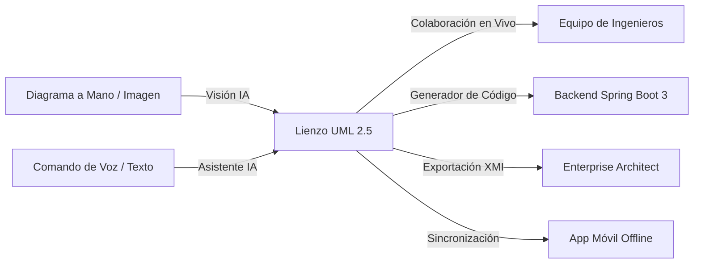
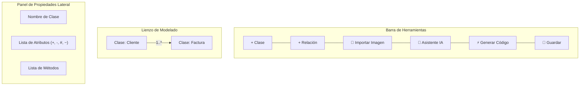
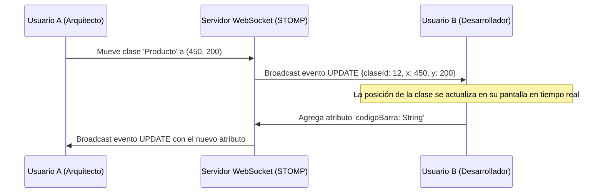
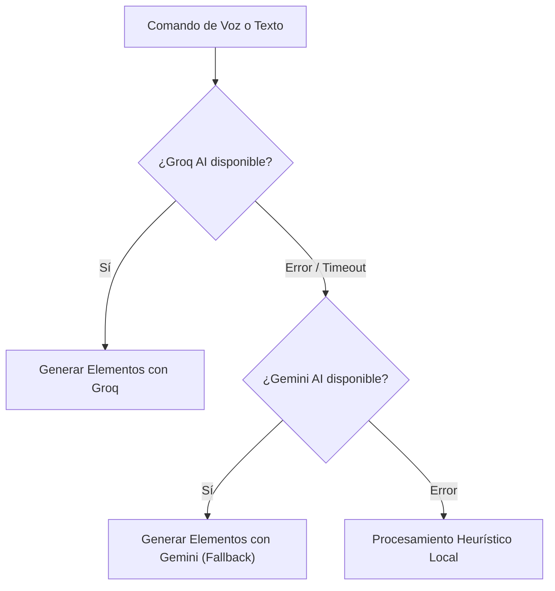
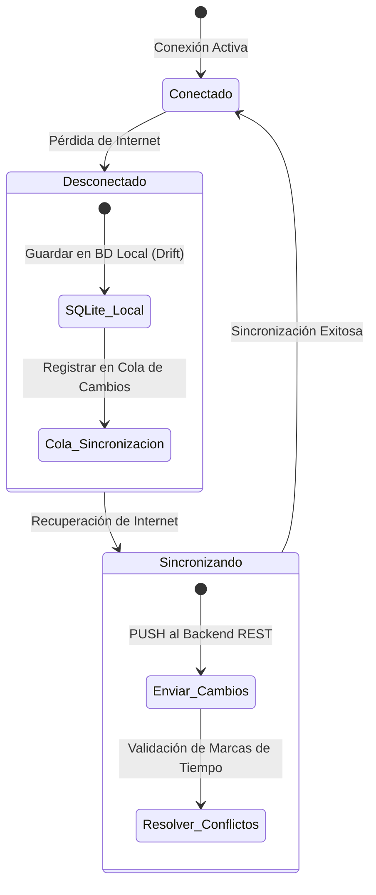

# MANUAL DE USUARIO
# CASE Platform (Computer-Aided Software Engineering)
### *Plataforma CASE Colaborativa Inteligente para Diseño UML 2.5 y Generación Automática de Software*

---

## 📋 FICHA TÉCNICA DEL SISTEMA

| Parámetro | Detalle |
| :--- | :--- |
| **Nombre del Sistema** | **CASE Platform** |
| **Versión del Software** | **1.0.0 (Release Estable)** |
| **Estándar de Modelado** | **UML 2.5 (Unified Modeling Language)** |
| **Arquitectura** | Microservicios / Modular desacoplado (Backend REST + SPA Web + Móvil Flutter) |
| **Backend** | Java 21 LTS, Spring Boot 3.3.4, Spring Data JPA, Spring Security (JWT), WebSocket (STOMP) |
| **Frontend Web** | React 18, TypeScript 5, Vite 5, React Flow, Tailwind CSS / Lucide Icons |
| **Aplicación Móvil** | Flutter 3.24+, Dart 3.5+, Drift (SQLite local), Provider |
| **Base de Datos Principal** | PostgreSQL 16+ (soporte UUID v4 y transacciones ACID) |
| **Motores de IA** | Groq (Llama 3 / Mixtral) con conmutación por error (fallback) a Google Gemini 1.5 Flash |
| **Visión Artificial** | Procesamiento OCR de imágenes + Detección Multimodal de Diagramas UML |

---

## 📑 TABLA DE CONTENIDOS

1. [Introducción y Objetivos](#1-introducción-y-objetivos)
2. [Requisitos del Sistema e Instalación](#2-requisitos-del-sistema-e-instalación)
3. [Inicio Rápido y Arranque de la Plataforma](#3-inicio-rápido-y-arranque-de-la-plataforma)
4. [Autenticación, Seguridad y Roles de Usuario](#4-autenticación-seguridad-y-roles-de-usuario)
5. [Panel de Control (Dashboard) y Gestión de Proyectos](#5-panel-de-control-dashboard-y-gestión-de-proyectos)
6. [Editor Visual UML 2.5 (Lienzo Interactivo)](#6-editor-visual-uml-25-lienzo-interactivo)
   - 6.1. Herramientas del Lienzo
   - 6.2. Creación y Edición de Clases
   - 6.3. Tipos de Datos y Visibilidad
   - 6.4. Creación y Gestión de Relaciones
7. [Colaboración Multiusuario en Tiempo Real](#7-colaboración-multiusuario-en-tiempo-real)
8. [Historial de Versiones y Restauración (Rollback)](#8-historial-de-versiones-y-restauración-rollback)
9. [Asistente Inteligente con IA (Comandos de Texto y Voz)](#9-asistente-inteligente-con-ia-comandos-de-texto-y-voz)
10. [Visión Artificial: Conversión de Imágenes a Diagramas UML](#10-visión-artificial-conversión-de-imágenes-a-diagramas-uml)
    - 10.1. Carga de Bocetos e Imágenes
    - 10.2. Resolución Automática de Relaciones Muchos a Muchos ($N:M$)
11. [Generador Automático de Backend Spring Boot 3](#11-generador-automático-de-backend-spring-boot-3)
12. [Interoperabilidad con Enterprise Architect (XMI 2.1)](#12-interoperabilidad-con-enterprise-architect-xmi-21)
13. [Aplicación Móvil y Modo Offline](#13-aplicación-móvil-y-modo-offline)
14. [Preguntas Frecuentes (FAQ) y Solución de Problemas](#14-preguntas-frecuentes-faq-y-solución-de-problemas)
15. [Glosario de Términos](#15-glosario-de-términos)

---

## 1. INTRODUCCIÓN Y OBJETIVOS

**CASE Platform** es una herramienta integral de Ingeniería de Software Asistida por Computadora diseñada para modernizar y agilizar el ciclo de vida del desarrollo de software:



### Principales Beneficios:
* **Aceleración del Modelado:** Permite pasar de una idea o fotografía de pizarra a un diagrama UML estructurado en segundos mediante IA y Visión Artificial.
* **Ingeniería Dirigida por Modelos (MDD):** Genera código fuente funcional en Spring Boot 3 (Entidades, Repositorios, Servicios y Controladores REST) listo para producción.
* **Resolución Estricta de Relaciones $N:M$:** Descompone automáticamente cualquier relación muchos a muchos en su entidad asociativa intermedia con claves foráneas y atributos contextuales.
* **Resiliencia con Múltiples APIs de IA:** Conmutación automática entre **Groq API** y **Gemini API** para garantizar alta disponibilidad en las consultas inteligentes.
* **Portabilidad y Modo Desconectado:** Soporte para dispositivos móviles con persistencia local que permite seguir trabajando sin conexión a Internet.

---

## 2. REQUISITOS DEL SISTEMA E INSTALACIÓN

### 2.1. Requisitos de Hardware Mínimos y Recomendados

| Componente | Mínimo | Recomendado |
| :--- | :--- | :--- |
| **Procesador** | Doble núcleo 2.0 GHz | Cuatro núcleos 2.5 GHz o superior (Intel i5/i7 o AMD Ryzen 5/7) |
| **Memoria RAM** | 4 GB | 8 GB o 16 GB |
| **Espacio en Disco** | 2 GB libres | 5 GB libres (SSD recomendado) |
| **Resolución de Pantalla** | 1280 x 720 px | 1920 x 1080 px (Full HD) o superior |
| **Dispositivos Entrada** | Ratón y teclado | Ratón con rueda/scroll + Micrófono para dictado por voz |

### 2.2. Requisitos de Software

1. **Sistema Operativo:** Windows 10/11 (64-bit), macOS Monterey+ o Linux Ubuntu 20.04+.
2. **Java Development Kit (JDK):** Versión 21 LTS (Eclipse Adoptium Temurin o OpenJDK 21).
3. **Apache Maven:** Versión 3.9.0 o superior.
4. **Node.js:** Versión 18.x o 20.x LTS.
5. **PostgreSQL:** Versión 15 o 16 (con servicio iniciado en el puerto 5432).
6. **Navegador Web Moderno:** Google Chrome 110+, Microsoft Edge 110+, Mozilla Firefox 115+ o Safari 16+.
7. **Flutter SDK (Opcional):** Versión 3.24+ para compilar o ejecutar el cliente móvil.

---

## 3. INICIO RÁPIDO Y ARRANQUE DE LA PLATAFORMA

Para comodidad del usuario, la plataforma incluye scripts de ejecución automatizada ubicados en la carpeta `software-case-platform/scripts/`.

### 3.1. Arranque Completo con un Solo Clic (`start-all.bat`)
Haga doble clic sobre el archivo `software-case-platform/scripts/start-all.bat` o ejecútelo desde una terminal de Windows:
```powershell
cd "software-case-platform\scripts"
.\start-all.bat
```
Este script realiza las siguientes acciones de forma automática:
1. Comprueba la conexión con PostgreSQL y valida el esquema `case_platform_db`.
2. Lanza el backend Spring Boot en el puerto `8080`.
3. Lanza el servidor frontend Vite en el puerto `5173`.
4. Abre su navegador web predeterminado en la URL: **`http://localhost:5173`**.

### 3.2. Arranque Manual por Componentes

#### Paso 1: Configurar e Inicializar la Base de Datos
Abra su consola de PostgreSQL y cree la base de datos:
```sql
CREATE DATABASE case_platform_db;
```
*(Opcional: Si desea cargar datos de prueba, ejecute el script `database/init.sql`).*

#### Paso 2: Iniciar el Servidor Backend
```powershell
cd software-case-platform\backend
mvn spring-boot:run
```
> El servicio backend estará disponible en: **`http://localhost:8080`**  
> Verificación de estado de salud (Health Check): **`http://localhost:8080/api/v1/health`**

#### Paso 3: Iniciar el Frontend Web
En otra ventana de terminal:
```powershell
cd software-case-platform\frontend
npm install
npm run dev
```
> La interfaz gráfica estará disponible en: **`http://localhost:5173`**

#### Paso 4: Iniciar la Aplicación Móvil (Opcional)
```powershell
cd software-case-platform\mobile
flutter pub get
flutter run
```

---

## 4. AUTENTICACIÓN, SEGURIDAD Y ROLES DE USUARIO

CASE Platform implementa un esquema de seguridad robusto basado en **JSON Web Tokens (JWT)** y control de acceso basado en roles (**RBAC**).

```
                      +-------------------+
                      | Pantalla de Login |
                      +---------+---------+
                                | (Credenciales)
                                v
                      +-------------------+
                      |   Servicio Auth   |
                      +---------+---------+
                                |
             +------------------+------------------+
             |                                     |
             v                                     v
     [Token JWT Válido]                   [Credenciales Inválidas]
             |                                     |
             v                                     v
    +-----------------+                    +----------------+
    | Acceso Dashboard|                    | Mensaje Error  |
    +-----------------+                    +----------------+
```

### 4.1. Inicio de Sesión
1. Ingrese a la plataforma desde `http://localhost:5173`.
2. Ingrese su correo electrónico y contraseña.
3. Haga clic en el botón **"Iniciar Sesión"**.

> [!NOTE]
> **Usuarios de demostración preconfigurados:**
> - **Administrador:** `admin@caseplatform.com` | Clave: `admin123`
> - **Arquitecto de Software:** `ingeniero.vision@caseplatform.com` | Clave: `password123`
> - **Desarrollador:** `dev@caseplatform.com` | Clave: `dev123`

### 4.2. Registro de Nuevos Usuarios
Si no posee una cuenta, haga clic en la pestaña o enlace **"Crear Cuenta"** en la pantalla de inicio:
1. Ingrese su Nombre Completo.
2. Proporcione un Correo Electrónico corporativo o personal válido.
3. Defina una contraseña segura (mínimo 6 caracteres).
4. Seleccione su rol principal deseado y confirme el registro.

### 4.3. Roles y Matriz de Privilegios

| Privilegio / Acción | ADMIN | ARQUITECTO | DESARROLLADOR | OBSERVADOR |
| :--- | :---: | :---: | :---: | :---: |
| Crear y Eliminar Proyectos | ✅ | ✅ | ❌ | ❌ |
| Editar Diagramas y Entidades | ✅ | ✅ | ✅ | ❌ |
| Usar Asistente de Voz e IA | ✅ | ✅ | ✅ | ❌ |
| Convertir Imágenes a UML | ✅ | ✅ | ✅ | ❌ |
| Generar Código Spring Boot | ✅ | ✅ | ✅ | ✅ |
| Exportar / Importar XMI | ✅ | ✅ | ✅ | ✅ |
| Restaurar Versiones Previas | ✅ | ✅ | ❌ | ❌ |
| Administrar Usuarios del Sistema | ✅ | ❌ | ❌ | ❌ |

---

## 5. PANEL DE CONTROL (DASHBOARD) Y GESTIÓN DE PROYECTOS

Al autenticarse, accederá a la pantalla principal del **Dashboard**, diseñada para centralizar toda su actividad:

```
+------------------------------------------------------------------------------------+
|  CASE PLATFORM    [🔍 Buscar proyecto...]     (👤 Usuario) (Rol: ARQUITECTO) [Salir] |
+------------------------------------------------------------------------------------+
|                                                                                    |
|  📊 RESUMEN GENERAL                                                                |
|  [ Proyectos Activos: 8 ]   [ Clases Modeladas: 42 ]   [ Versiones Guardadas: 19 ] |
|                                                                                    |
|  📁 MIS PROYECTOS UML                              [ + Nuevo Proyecto ]            |
|  +---------------------------+  +---------------------------+                      |
|  | Sistema Hospitalario      |  | Tienda E-Commerce         |                      |
|  | 5 Clases | 4 Relaciones   |  | 8 Clases | 7 Relaciones   |                      |
|  | Últ. cambio: hace 1 hora  |  | Últ. cambio: hace 3 horas |                      |
|  | [ Abrir ] [ ⚙️ ] [ 🗑️ ]   |  | [ Abrir ] [ ⚙️ ] [ 🗑️ ]   |                      |
|  +---------------------------+  +---------------------------+                      |
+------------------------------------------------------------------------------------+
```

### 5.1. Crear un Nuevo Proyecto
1. En la parte superior derecha, pulse el botón azul **"+ Nuevo Proyecto"**.
2. En la ventana modal emergente:
   - **Nombre del Proyecto:** Ej. *Sistema de Facturación Electrónica*.
   - **Descripción:** Breve resumen del alcance o arquitectura del sistema.
3. Presione **"Crear Proyecto"**. El sistema creará el modelo inicial y lo redirigirá inmediatamente al editor gráfico.

### 5.2. Buscar y Filtrar Proyectos
Utilice la barra de búsqueda superior para filtrar proyectos por nombre o palabras clave en tiempo real.

### 5.3. Abrir o Eliminar un Proyecto
- **Abrir:** Haga clic en la tarjeta del proyecto o en el botón **"Abrir"** para ingresar al lienzo de modelado.
- **Eliminar:** Haga clic en el icono del cesto de basura (`🗑️`) para borrar un proyecto. El sistema le solicitará confirmación antes de proceder.

---

## 6. EDITOR VISUAL UML 2.5 (LIENZO INTERACTIVO)

El editor visual es el núcleo de trabajo de la plataforma. Ofrece un lienzo infinito interactivo con soporte para arrastrar, soltar, conectar y reordenar elementos.



### 6.1. Herramientas del Lienzo
* **Paneo y Desplazamiento:** Mantenga presionado el botón derecho del ratón o el botón central (rueda) y mueva el cursor para desplazarse por el lienzo.
* **Zoom In / Zoom Out:** Gire la rueda del ratón o use los controles de zoom `+` y `-` ubicados en la esquina inferior izquierda.
* **Auto-Layout:** Organiza automáticamente todas las cajas del diagrama en una cuadrícula simétrica sin solapamientos.

### 6.2. Creación y Edición de Clases
1. Haga clic en el botón **"+ Clase"** de la barra de herramientas.
2. Ingrese el **Nombre de la Clase** en notación *PascalCase* (ej. `Pedido`, `Usuario`, `Inventario`).
3. La nueva clase aparecerá en el lienzo. Para editar sus propiedades, haga clic sobre ella: se desplegará el **Panel Lateral de Propiedades**.

### 6.3. Tipos de Datos y Visibilidad

#### Visibilidad Soportada:
* `+` **Público (Public):** Accesible desde cualquier componente.
* `-` **Privado (Private):** Solo accesible dentro de la propia clase (predeterminado para atributos).
* `#` **Protegido (Protected):** Accesible por la clase y sus subclases.
* `~` **Paquete (Package):** Accesible por clases del mismo paquete.

#### Tipos de Datos Estándar:
`String`, `Integer`, `Long`, `Double`, `Boolean`, `LocalDate`, `LocalDateTime`, `BigDecimal`, `byte[]`.

#### Agregar Atributos y Métodos:
1. En el panel de propiedades, presione **"+ Agregar Atributo"**.
2. Escriba el nombre (ej. `precioUnitario`), elija el tipo de dato y la visibilidad.
3. Para métodos, presione **"+ Agregar Método"**, especifique el nombre (ej. `calcularTotal`), el tipo de retorno y los parámetros.

### 6.4. Creación y Gestión de Relaciones
Para conectar dos clases:
1. Pase el cursor sobre los conectores circulares (puntos azules) ubicados en los bordes de la clase origen.
2. Haga clic y arrastre la línea hacia la clase destino.
3. Se abrirá la ventana modal de configuración de la relación donde podrá definir:
   - **Tipo de Relación:**
     - **Asociación:** Conexión directa estándar entre clases.
     - **Agregación (Rombo hueco):** Relación todo-parte débil.
     - **Composición (Rombo relleno):** Relación todo-parte fuerte donde la existencia de la parte depende del todo.
     - **Herencia / Generalización (Flecha triangular hueca):** Define que una subclase hereda de una superclase.
     - **Dependencia (Flecha punteada):** Indica que una clase utiliza a otra temporalmente.
   - **Cardinalidad Origen y Destino:** Seleccione `1`, `0..1`, `*`, `1..*` o especifique rangos personalizados.
   - **Descripción / Rol:** Nombre descriptivo de la relación (ej. *realiza*, *contiene*, *pertenece*).

---

## 7. COLABORACIÓN MULTIUSUARIO EN TIEMPO REAL

CASE Platform permite que múltiples ingenieros de software trabajen simultáneamente sobre el mismo diagrama sin sobreescrituras accidentales gracias a su motor **WebSocket (STOMP)**.



### Funcionalidades de Colaboración:
1. **Indicador de Usuarios Conectados:** En la esquina superior derecha del editor, verá los avatares y nombres de los colegas presentes en la sala.
2. **Sincronización Instantánea:** Al mover una clase, añadir atributos o cambiar cardinalidades, los cambios se reflejan en las pantallas de todos los usuarios en milisegundos.
3. **Indicador de Conexión:** Un punto verde indica conexión en vivo activa. Si la conexión se interrumpe temporalmente, el sistema intentará reconectarse automáticamente.

---

## 8. HISTORIAL DE VERSIONES Y RESTAURACIÓN (ROLLBACK)

No pierda nunca el estado de sus diagramas. El sistema de control de versiones permite auditar cambios y volver a cualquier estado previo con total seguridad.

```
+-----------------------------------------------------------------+
|  🕒 HISTORIAL DE VERSIONES DEL MODELO                           |
|  [ + Guardar Nueva Versión ]                                    |
|                                                                 |
|  • Versión 3 (Actual)                                           |
|    Autor: ingeniero.vision@caseplatform.com | Hace 15 minutos   |
|    Descripción: Se agregó entidad asociativa Detalle_Venta       |
|                                                                 |
|  • Versión 2                                                    |
|    Autor: dev@caseplatform.com | Hace 2 horas                   |
|    Descripción: Estructura base de Cliente y Factura            |
|    [ 👁️ Previsualizar ]  [ 🔄 Restaurar esta versión ]          |
|                                                                 |
|  • Versión 1 (Inicial)                                          |
|    Autor: admin@caseplatform.com | Ayer a las 18:30             |
|    Descripción: Creación inicial del proyecto                   |
+-----------------------------------------------------------------+
```

### 8.1. Crear una Versión Manualmente
1. En la barra superior del editor, haga clic en el botón **"Versiones"**.
2. En el panel desplegado, pulse **"+ Crear Versión"**.
3. Ingrese una descripción clara (ej. *Arquitectura aprobada para Sprint 2*).
4. El sistema tomará una instantánea inmutable (*snapshot*) del diagrama.

### 8.2. Restaurar una Versión Previa (Rollback)
1. Localice la versión a la que desea regresar en la lista del panel.
2. Presione el botón **"Restaurar esta versión"**.
3. El sistema solicitará confirmación antes de aplicar el estado anterior. Al confirmar, el lienzo se actualizará automáticamente y se notificará a los demás colaboradores.

---

## 9. ASISTENTE INTELIGENTE CON IA (COMANDOS DE TEXTO Y VOZ)

La plataforma cuenta con un asistente de Inteligencia Artificial integrado que permite modelar diagramas simplemente hablando o escribiendo instrucciones en lenguaje natural.

### 9.1. Arquitectura Dual de IA (Resiliencia Total)
El sistema opera con dos motores de inteligencia artificial conectados en modo de respaldo (*fallback*):
1. **Motor Primario:** **Groq AI** (Modelos de ultra-baja latencia Llama 3 / Mixtral).
2. **Motor Secundario:** **Google Gemini 1.5** (Respaldo automático en caso de saturación, caída de red o límite de cuota).



### 9.2. Uso del Asistente mediante Micrófono (Voz)
1. En el editor UML, presione el botón flotante del **Asistente IA** o el icono del **Micrófono** (`🎙️`).
2. Si es la primera vez, su navegador le solicitará permisos para acceder al micrófono. Presione **"Permitir"**.
3. Al encenderse el indicador rojo de grabación, hable con voz clara.
4. Presione nuevamente el botón para detener la grabación. El sistema transcribirá su voz a texto y ejecutará la orden de inmediato.

> [!TIP]
> **Consejo para el uso por voz:** Hable en un ambiente con poco ruido y utilice nombres descriptivos para las clases y atributos.

### 9.3. Ejemplos de Comandos Soportados

| Intención | Ejemplo de Comando por Voz o Texto |
| :--- | :--- |
| **Crear Clase Simple** | *"Crea una clase llamada Producto con atributos id de tipo Long y precio de tipo Double"* |
| **Crear Múltiples Clases** | *"Crea la clase Estudiante y la clase Curso"* |
| **Agregar Métodos** | *"Añade a la clase Factura el método calcularImpuesto que retorne Double"* |
| **Crear Relación** | *"Crea una relación de composición entre Empresa y Departamento"* |
| **Modelado de Dominio Completo** | *"Genera el modelo UML para un sistema de biblioteca con Libro, Autor y Prestamo"* |

---

## 10. VISIÓN ARTIFICIAL: CONVERSIÓN DE IMÁGENES A DIAGRAMAS UML

¿Dibujó un diagrama en una pizarra o en una hoja de papel? El módulo de visión artificial de CASE Platform digitaliza bocetos y fotografías transformándolos en clases y relaciones interactivas.

```
+-----------------------------------------------------------------+
|  📷 IMPORTAR DIAGRAMA DESDE IMAGEN                              |
|                                                                 |
|   +-------------------------------------------------------+     |
|   |         Arrastre su imagen aquí o haga clic           |     |
|   |             Formatos: PNG, JPG, JPEG (máx. 10MB)      |     |
|   +-------------------------------------------------------+     |
|                                                                 |
|   ℹ️ REGLA AUTOMÁTICA DE DISEÑO:                                |
|   Cualquier relación Muchos a Muchos (N:M) se descompondrá      |
|   automáticamente creando la tabla intermedia asociativa        |
|   con sus claves foráneas (FK) y atributos contextuales.        |
|                                                                 |
|   [ Cancelar ]                        [ ⚡ Procesar Imagen ]    |
+-----------------------------------------------------------------+
```

### 10.1. Carga y Procesamiento de la Imagen
1. En la barra superior, haga clic en el botón **"Importar Imagen"** (`📷`).
2. Seleccione un archivo de imagen desde su ordenador o arrástrelo a la zona delimitada.
3. Presione el botón **"Procesar Imagen"**.
4. El motor ejecutará el preprocesamiento gráfico (filtros de umbralización, realce de contornos y OCR) y enviará los datos al modelo de visión multimodal.
5. El sistema mostrará una previsualización de las clases y relaciones detectadas para que usted pueda confirmar la importación al lienzo.

---

### 10.2. Resolución Automática de Relaciones Muchos a Muchos ($N:M$)

Por estándar de buenas prácticas de ingeniería de software y normalización de bases de datos relacionales, **la plataforma nunca deja relaciones directas de muchos a muchos**. Si en la imagen se detecta una relación $N:M$ (o $1..\text{*} \leftrightarrow 1..\text{*}$), el sistema la descompone automáticamente:

```mermaid
classDiagram
    direction LR
    class Estudiante {
        - Long id
        - String matricula
        - String nombre
    }
    class Inscripcion {
        - Long id
        - Long id_estudiante
        - Long id_curso
        - LocalDate fecha_inscripcion
        - Double nota_final
        - String estado
    }
    class Curso {
        - Long id
        - String codigo
        - String titulo
    }

    Estudiante "1" --> "*" Inscripcion : Asociación 1:N
    Curso "1" --> "*" Inscripcion : Asociación 1:N
```

#### Reglas de Transformación Aplicadas:
1. **Nombre Descriptivo de la Entidad Intermedia:**
   - `Venta` $\leftrightarrow$ `Producto` $\rightarrow$ **`Detalle_Venta`**
   - `Pedido` $\leftrightarrow$ `Producto` $\rightarrow$ **`Detalle_Pedido`**
   - `Factura` $\leftrightarrow$ `Producto` $\rightarrow$ **`Detalle_Factura`**
   - `Estudiante` $\leftrightarrow$ `Curso` $\rightarrow$ **`Inscripcion`**
   - `Empleado` $\leftrightarrow$ `Proyecto` $\rightarrow$ **`Asignacion`**
   - `Médico` $\leftrightarrow$ `Paciente` $\rightarrow$ **`Cita_Medica`**
   - Si los nombres no coinciden con un patrón conocido, se nombra `{ClaseA}_{ClaseB}`.
2. **Claves Primarias y Foráneas (FKs):**
   - Se genera una clave primaria propia: `id: Long`.
   - Se crean las claves foráneas hacia ambas entidades padre: `id_<claseA>: Long` y `id_<claseB>: Long`.
3. **Atributos Propios Contextuales:**
   - En comercio/ventas: `cantidad: Integer`, `precio_unitario: Double`, `subtotal: Double`, `fecha_registro: LocalDate`.
   - En educación: `fecha_inscripcion: LocalDate`, `nota_final: Double`, `estado: String`.
   - En gestión de proyectos: `fecha_asignacion: LocalDate`, `horas_dedicadas: Integer`, `rol: String`.
4. **Relaciones Resultantes:**
   - Se crean dos relaciones de cardinalidad **$1 \rightarrow \text{*}$** desde cada tabla padre hacia la tabla asociativa intermedia.

---

## 11. GENERADOR AUTOMÁTICO DE BACKEND SPRING BOOT 3

Transforme su diseño conceptual UML en una aplicación backend completa y compilable con **Spring Boot 3 (Java 21)**.

### 11.1. Cómo Generar el Código Fuente
1. Una vez finalizado su diagrama UML, haga clic en el botón verde **"Generar Backend"** (`⚡`) en la barra de herramientas.
2. Complete los datos de configuración en el formulario:
   - **Nombre del Proyecto:** Ej. *gestion-ventas-api*.
   - **Group ID:** Ej. `com.miempresa.sistema`.
   - **Artifact ID:** Ej. `ventas-service`.
   - **Versión de Java:** Seleccione `Java 21` (recomendado).
   - **Motor de Base de Datos:** PostgreSQL / MySQL / H2.
3. Presione el botón **"Generar y Descargar ZIP"**.

### 11.2. Estructura del Proyecto Spring Boot Generado
El archivo ZIP descargado contiene la siguiente arquitectura limpia por capas lista para compilar:

```
proyecto-generado/
├── src/
│   ├── main/
│   │   ├── java/com/miempresa/sistema/
│   │   │   ├── config/             # Configuración Swagger OpenAPI 3 y CORS
│   │   │   ├── controller/         # Controladores REST con endpoints CRUD completos
│   │   │   ├── dto/                # Data Transfer Objects (CreateDTO, ResponseDTO)
│   │   │   ├── exception/          # Manejo global de excepciones (@ControllerAdvice)
│   │   │   ├── model/              # Entidades JPA (@Entity, @Table, @OneToMany, @ManyToOne)
│   │   │   ├── repository/         # Repositorios Spring Data JPA (JpaRepository)
│   │   │   ├── service/            # Lógica de negocio (Interfaces e Implementaciones)
│   │   │   └── Application.java    # Clase principal @SpringBootApplication
│   │   └── resources/
│   │       ├── application.yml     # Configuración de base de datos y puertos
│   │       └── schema.sql          # Script DDL de creación de tablas
├── pom.xml                         # Dependencias Maven configuradas (Spring Web, JPA, Postgres, Lombok)
└── README.md                       # Instrucciones de compilación y ejecución local
```

### 11.3. Compilación y Ejecución del Proyecto Generado
Descomprima el archivo ZIP y ejecute en su terminal:
```bash
cd proyecto-generado
mvn clean install
mvn spring-boot:run
```
La documentación interactiva de la API estará disponible de inmediato en Swagger UI:
`http://localhost:8080/swagger-ui.html`

---

## 12. INTEROPERABILIDAD CON ENTERPRISE ARCHITECT (XMI 2.1)

CASE Platform no es una isla; se integra de forma transparente con herramientas consolidadas del sector corporativo mediante el estándar **XMI 2.1 (XML Metadata Interchange)**.

### 12.1. Exportar a Enterprise Architect
1. En la barra superior, haga clic en el botón **"Exportar XMI"**.
2. El sistema generará un archivo con extensión `.xmi` compatible con **Enterprise Architect**, **Visual Paradigm** y **StarUML**.
3. Guarde el archivo en su computadora. Para abrirlo en Enterprise Architect:
   - Abra Enterprise Architect.
   - Seleccione un paquete en el navegador de proyectos.
   - Vaya a *Publish > Import XMI > Import Model from XMI*.

### 12.2. Importar Archivos XMI
1. Pulse el botón **"Importar XMI"**.
2. Seleccione un archivo `.xmi` o `.xml` generado previamente.
3. El motor de análisis validará los paquetes, clases, atributos y conectores e importará el modelo directamente a su lienzo de trabajo.

---

## 13. APLICACIÓN MÓVIL Y MODO OFFLINE

Para profesionales en movimiento, la plataforma incluye una aplicación móvil desarrollada en **Flutter** disponible para Android e iOS.

### 13.1. Funcionalidades de la App Móvil
* **Visualización de Proyectos:** Consulte en cualquier momento los diagramas creados en la plataforma web.
* **Consulta de Entidades:** Explore clases, atributos y métodos de manera optimizada para pantallas táctiles.
* **Asistente de IA Móvil:** Realice consultas sobre sus modelos directamente desde su teléfono.



### 13.2. Modo Offline (Desconectado)
1. Si pierde la conexión a Internet o se encuentra en una zona sin cobertura, la app móvil conmuta automáticamente al **Modo Offline**.
2. Los datos se almacenan en una base de datos local embebida de alto rendimiento (**Drift / SQLite**).
3. Todas las operaciones que realice se registrarán en una cola de sincronización pendiente.
4. Tan pronto como el dispositivo recupere la señal Wi-Fi o datos móviles, la aplicación sincronizará automáticamente los cambios con el servidor central mediante el **Centro de Sincronización**.

---

## 14. PREGUNTAS FRECUENTES (FAQ) Y SOLUCIÓN DE PROBLEMAS

### P1: El reconocimiento por voz no responde o muestra error de micrófono.
> **Solución:**
> 1. Asegúrese de que el sitio cuenta con permisos de micrófono en su navegador. En Google Chrome, haga clic en el icono del candado al lado de la barra de direcciones (`http://localhost:5173`) y verifique que el permiso de **Micrófono** esté en **"Permitir"**.
> 2. Verifique en la configuración de sonido de su sistema operativo que el micrófono esté seleccionado como dispositivo predeterminado y con volumen suficiente.
> 3. La plataforma utiliza reconocimiento nativo del navegador respaldado por el endpoint Whisper del backend.

### P2: Al subir una imagen de diagrama, ¿por qué no aparecen relaciones directas $N:M$?
> **Respuesta:**
> Es el comportamiento correcto y deseado del sistema. Siguiendo las directivas de diseño de software y normalización de bases de datos, el sistema descompone automáticamente las relaciones de muchos a muchos ($N:M$) en una **entidad asociativa (tabla intermedia / pivote)** con sus respectivas claves foráneas (`id_<origen>`, `id_<destino>`) y atributos de contexto (ej. `cantidad`, `precio_unitario`, `fecha_registro`).

### P3: ¿Qué sucede si la API de Groq no responde o excede su cuota?
> **Respuesta:**
> El sistema cuenta con tolerancia a fallos automática (*failover*). Si la API de Groq experimenta algún inconveniente, la petición se redirige de manera transparente a la **API de Google Gemini**, permitiéndole continuar su trabajo sin interrupciones.

### P4: El backend no inicia indicando error de conexión a la base de datos.
> **Solución:**
> 1. Verifique que el servicio de **PostgreSQL** se encuentre en ejecución (puerto 5432).
> 2. Confirme que la base de datos `case_platform_db` esté creada:
>    ```sql
>    psql -U postgres -c "CREATE DATABASE case_platform_db;"
>    ```
> 3. Si la contraseña de su usuario `postgres` es distinta de `password`, actualícela en el archivo `software-case-platform/.env` o `application.yml`.

### P5: Dos usuarios modifican el mismo diagrama a la vez, ¿cómo se resuelven los cambios?
> **Respuesta:**
> El motor WebSocket difunde eventos atómicos por elemento. Si dos usuarios mueven clases distintas o añaden atributos, ambas acciones se integran en tiempo real. En caso de discrepancias sobre el mismo elemento, prevalece la última modificación recibida en el servidor (*Last-Write-Wins*), quedando registrado en el historial de versiones.

---

## 15. GLOSARIO DE TÉRMINOS

* **CASE (Computer-Aided Software Engineering):** Conjunto de herramientas y métodos informáticos que facilitan la automatización de las actividades del desarrollo de software.
* **UML (Unified Modeling Language):** Lenguaje de modelado visual estándar para especificar, construir y documentar artefactos de sistemas software.
* **Entidad Asociativa / Tabla Intermedia:** Entidad que descompone una relación muchos a muchos ($N:M$) entre dos entidades principales en dos relaciones uno a muchos ($1:N$), almacenando claves foráneas y atributos propios de la relación.
* **JWT (JSON Web Token):** Estándar abierto (RFC 7519) que define una forma compacta y autónoma para transmitir información segura entre partes como un objeto JSON.
* **STOMP:** Protocolo simple de mensajería orientada a texto que opera sobre WebSockets para comunicación bidireccional cliente-servidor.
* **XMI (XML Metadata Interchange):** Estándar de la OMG (Object Management Group) para intercambiar metadatos de modelos UML entre distintas herramientas de software.
* **JPA (Java Persistence API):** Especificación estándar de Java para la gestión de datos relacionales en aplicaciones empresariales mediante mapeo objeto-relacional (ORM).
* **Rollback:** Operación que restaura un sistema o modelo de datos a un estado o versión previamente registrada.
* **Offline-First:** Filosofía de diseño de software donde la aplicación móvil funciona completamente sin conexión a internet y se sincroniza cuando hay conectividad disponible.

---

> **CASE Platform v1.0.0** — Desarrollado para la materia de Software 1.  
> Documento generado conforme a los estándares de ingeniería de software.
