# FASE 8 — Conversión de Imagen a Modelo UML mediante Visión Artificial

## 1. Visión General del Módulo

El subsistema de **Conversión de Imagen a Modelo UML** dota a la **Plataforma CASE Colaborativa** de capacidades avanzadas de visión artificial, procesamiento digital de imágenes y reconocimiento óptico de caracteres (OCR) / multimodal. 

Su propósito fundamental es permitir a los ingenieros de software digitalizar y reutilizar diagramas conceptuales UML provenientes de:
- Bocetos en papel y libretas de diseño.
- Diagramas dibujados en pizarras físicas durante sesiones de brainstorming.
- Capturas de pantalla de diagramas o documentos PDF.
- Diseños conceptuales exportados de herramientas externas o suites gráficas.

> [!IMPORTANT]
> **RESTRICCIÓN FUNDAMENTAL DEL MÓDULO**:
> El sistema **NO debe limitarse a mostrar una imagen gráfica incrustada en el editor**. El resultado de la conversión es una estructura digital completamente integrada en el metamodelo UML 2.5 de la plataforma, creando entidades de dominio reales (`ClaseUML`, `AtributoUML`, `MetodoUML`, `RelacionUML`, visibilidades y cardinalidades) que pueden ser modificadas, movidas, conectadas y versionadas libremente en el lienzo visual.

---

## 2. Arquitectura del Módulo

El módulo adopta una arquitectura desacoplada y robusta organizada en dos capas principales:

```
┌─────────────────────────────────────────────────────────────────────────────┐
│                              FRONTEND REACT                                 │
│  ┌──────────────────────────────┐     ┌──────────────────────────────────┐  │
│  │      ImageUploader           │     │       ProcessingStatus           │  │
│  │  - Drag & Drop interactivo   │     │  - Stepper visual 3 fases        │  │
│  │  - Validación formato y MB   │     │  - Animación y tiempos           │  │
│  └──────────────┬───────────────┘     └──────────────────────────────────┘  │
│                 │                                                           │
│                 ▼                                                           │
│  ┌──────────────────────────────┐     ┌──────────────────────────────────┐  │
│  │       ResultPreview          │     │        ImageUMLModal             │  │
│  │  - Inspección lado a lado    │     │  - Orquestador de flujo          │  │
│  │  - Corrección manual en vivo │     │  - Integración con useUMLStore   │  │
│  └──────────────┬───────────────┘     └──────────────────────────────────┘  │
└─────────────────┼───────────────────────────────────────────────────────────┘
                  │ Multipart Form Data / JSON REST
                  ▼
┌─────────────────────────────────────────────────────────────────────────────┐
│                           BACKEND SPRING BOOT                               │
│  ┌───────────────────────────────────────────────────────────────────────┐  │
│  │                      ImageUploadController                            │  │
│  │   POST /api/imageuml/upload       POST /api/imageuml/models/{id}/apply│  │
│  │   POST /api/imageuml/convert      GET  /api/imageuml/{id}             │  │
│  └──────────────────────────────────┬────────────────────────────────────┘  │
│                                     │                                       │
│                                     ▼                                       │
│  ┌───────────────────────────────────────────────────────────────────────┐  │
│  │                       ImageToUMLService                               │  │
│  │   - Orquestador del ciclo de vida, persistencia y versionado          │  │
│  └──────┬───────────────────────────┬─────────────────────────────┬──────┘  │
│         │                           │                             │         │
│         ▼                           ▼                             ▼         │
│  ┌──────────────┐            ┌──────────────┐             ┌──────────────┐  │
│  │ImageProcessor│            │ UMLDetector  │             │UMLTextParser │  │
│  │  Service     │            │   Service    │             │              │  │
│  │(Filtros 2D)  │            │(Dual-Tier AI)│             │(Gramática 2.5│  │
│  └──────────────┘            └──────────────┘             └──────────────┘  │
│         │                           │                             │         │
│         ▼                           ▼                             ▼         │
│  ┌──────────────────────────────┐     ┌──────────────────────────────────┐  │
│  │     ImagenUMLRepository      │     │      VersionService & WebSocket  │  │
│  │  (PostgreSQL BYTEA + TEXT)   │     │  - Registro de versión histórica │  │
│  │                              │     │  - Difusión /topic/modelo/{id}   │  │
│  └──────────────────────────────┘     └──────────────────────────────────┘  │
└─────────────────────────────────────────────────────────────────────────────┘
```

---

## 3. Pipeline de Visión Artificial y Procesamiento Digital

Para maximizar la tasa de acierto del reconocimiento OCR y la segmentación de cajas de clases y conectores de relación, la imagen atraviesa un pipeline de preprocesamiento algorítmico implementado en `ImageProcessorService`:

```mermaid
flowchart LR
    A["Imagen Original (PNG/JPG)"] --> B["1. Redimensionamiento Proporcional"]
    B --> C["2. Conversión a Escala de Grises (Luminancia)"]
    C --> D["3. Filtro Gaussiano 3x3 (Reducción de Ruido)"]
    D --> E["4. Estiramiento de Contraste Dinámico"]
    E --> F["5. Convolución de Bordes Sobel"]
    F --> G["6. Umbralización Adaptativa Otsu"]
    G --> H["Imagen Binarizada Optimizada"]
```



### Detalle de las etapas algorítmicas:
1. **Redimensionamiento Proporcional**:
   - Ajusta imágenes de alta resolución a una dimensión máxima de 1920x1080 píxeles preservando estrictamente la relación de aspecto (`aspect ratio`) para evitar distorsiones de conectores.
2. **Conversión a Escala de Grises**:
   - Emplea la fórmula estándar ITU-R BT.709 de luminancia perceptiva:
     $$Y = 0.2126 \cdot R + 0.7152 \cdot G + 0.0722 \cdot B$$
3. **Filtro Gaussiano 3x3**:
   - Matriz de convolución para atenuar ruido de alta frecuencia propio de cámaras móviles y texturas de papel:
     $$K = \frac{1}{16} \begin{bmatrix} 1 & 2 & 1 \\ 2 & 4 & 2 \\ 1 & 2 & 1 \end{bmatrix}$$
4. **Mejora Dinámica de Contraste (Histogram Stretching)**:
   - Identifica el percentil mínimo y máximo de intensidad de la imagen y normaliza los píxeles a $[0, 255]$, permitiendo que diagramas dibujados con tinta suave o lápiz aumenten su legibilidad.
5. **Detección de Bordes Sobel**:
   - Aplica kernels horizontales y verticales para resaltar contornos rectangulares de clases y trazos lineales de relaciones:
     $$G_x = \begin{bmatrix} -1 & 0 & 1 \\ -2 & 0 & 2 \\ -1 & 0 & 1 \end{bmatrix}, \quad G_y = \begin{bmatrix} -1 & -2 & -1 \\ 0 & 0 & 0 \\ 1 & 2 & 1 \end{bmatrix}$$
6. **Umbralización Adaptativa (Binarización de Otsu)**:
   - Separa automáticamente el fondo blanco/claro del trazo negro de las cajas y textos calculando el umbral que minimiza la varianza intra-clase.

---

## 4. Estrategia Dual de Reconocimiento UML (Dual-Tier Engine)

Para garantizar alta precisión semántica y disponibilidad operativa en cualquier entorno (incluyendo entornos sin conexión externa o pruebas de integración continuas), el sistema implementa una arquitectura **Dual-Tier**:

1. **Tier 1 — Visión Multimodal con Inteligencia Artificial (OpenAI GPT-4o Vision)**:
   - Se activa cuando la variable `OPENAI_API_KEY` está configurada en el entorno.
   - Envía la imagen codificada en Base64 junto con un prompt estructurado del metamodelo UML 2.5.
   - Extrae con precisión nombres de clases, atributos tipados, firmas completas de métodos, tipos de relación (Asociación, Herencia, Composición, Agregación, Dependencia) y cardinalidades (`1`, `0..1`, `*`, `1..*`).
2. **Tier 2 — Motor Heurístico de Visión Computacional y OCR Offline (Fallback Automático)**:
   - Se activa cuando la clave de IA no está presente o en caso de error de conectividad externa.
   - Analiza la morfología, contornos segmentados, patrones de texto y símbolos conectores (`<|--`, `*--`, `o--`, `-->`, `--`).
   - Normaliza automáticamente tipos de datos primitivos (`text` $\rightarrow$ `String`, `int` $\rightarrow$ `Integer`, `bool` $\rightarrow$ `Boolean`) y símbolos de visibilidad (`+` $\rightarrow$ `PUBLIC`, `-` $\rightarrow$ `PRIVATE`, `#` $\rightarrow$ `PROTECTED`, `~` $\rightarrow$ `PACKAGE`).
   - Distribuye las clases detectadas en una cuadrícula visual no superpuesta para su representación inicial en el lienzo.

---

## 5. Especificación de la API REST

| Método | Endpoint | Consumes / Produces | Descripción |
| :--- | :--- | :--- | :--- |
| `POST` | `/api/imageuml/upload` | `multipart/form-data` $\rightarrow$ `application/json` | Carga una imagen, ejecuta preprocesamiento visual, detecta entidades UML y devuelve el DTO con clases y relaciones. |
| `POST` | `/api/imageuml/models/{modeloId}/apply` | `application/json` $\rightarrow$ `application/json` | Aplica el modelo detectado (con posibles correcciones manuales) al modelo UML en BD, registra versión y emite WebSocket. |
| `POST` | `/api/imageuml/models/{modeloId}/convert` | `multipart/form-data` $\rightarrow$ `application/json` | Conversión directa de un paso: sube, detecta y aplica inmediatamente al modelo destino. |
| `GET` | `/api/imageuml/{imagenId}` | `application/json` | Consulta metadatos, estado y resultado UML de una imagen previamente procesada. |
| `GET` | `/api/imageuml/{imagenId}/file` | `image/png` | Descarga el archivo binario almacenado para visualización lado a lado en el cliente. |

### Ejemplo de Petición `POST /api/imageuml/models/{modeloId}/apply`:
```json
{
  "idImagen": 42,
  "modeloAjustado": {
    "clases": [
      {
        "nombre": "Cliente",
        "visibilidad": "PUBLIC",
        "posicionX": 150.0,
        "posicionY": 120.0,
        "atributos": [
          { "nombre": "id", "tipoDato": "Long", "visibilidad": "PRIVATE" },
          { "nombre": "nombre", "tipoDato": "String", "visibilidad": "PRIVATE" }
        ],
        "metodos": [
          { "nombre": "calcularDescuento", "tipoRetorno": "double", "visibilidad": "PUBLIC", "parametros": "porcentaje: double" }
        ]
      },
      {
        "nombre": "Pedido",
        "visibilidad": "PUBLIC",
        "posicionX": 550.0,
        "posicionY": 120.0,
        "atributos": [
          { "nombre": "total", "tipoDato": "BigDecimal", "visibilidad": "PRIVATE" }
        ],
        "metodos": []
      }
    ],
    "relaciones": [
      {
        "claseOrigen": "Cliente",
        "claseDestino": "Pedido",
        "tipoRelacion": "ASOCIACION",
        "cardinalidadOrigen": "1",
        "cardinalidadDestino": "*",
        "descripcion": "realiza"
      }
    ]
  },
  "limpiarModeloExistente": false,
  "comentario": "Importación desde boceto de pizarra"
}
```

---

## 6. Integración con Versionado (Fase 6) y Colaboración en Tiempo Real (Fase 5)

Toda conversión de imagen a modelo UML está formalmente enlazada con los sistemas preexistentes de la plataforma:

1. **Control de Versiones y Auditoría**:
   - Cada llamada a `aplicarModeloDetectado(...)` invoca `versionService.crearVersion(...)` registrando:
     - Etiqueta de versión: `"Versión Generada desde Imagen (<nombre_archivo>)"`.
     - Imagen origen y usuario autenticado.
     - Snapshot JSON del estado completo del diagrama antes y después de la importación.
2. **Colaboración en Tiempo Real (WebSockets / STOMP)**:
   - Al persistir las nuevas clases y relaciones, `ImageToUMLService` publica un evento `UPDATE` al canal `/topic/modelo/{modeloId}` a través de `EventPublisher`.
   - Los demás usuarios con el diagrama abierto reciben la actualización instantáneamente en sus lienzos de React Flow sin necesidad de recargar la página.

---

## 7. Interfaz de Usuario (Frontend)

El módulo se organiza bajo `frontend/src/features/imageuml/`:
- **`ImageUploader`**: Zona drag & drop interactiva que valida formatos (`PNG`, `JPG`, `JPEG`) y tamaños ($\le 10\text{ MB}$), mostrando miniatura de previsualización antes del análisis.
- **`ProcessingStatus`**: Indicador visual dinámico con los tres estados secuenciales obligatorios:
  1. *Procesando imagen...*
  2. *Detectando clases...*
  3. *Generando modelo UML...*
- **`ResultPreview`**: Pantalla de revisión interactiva que permite:
  - Inspeccionar la imagen original junto al modelo extraído.
  - Modificar nombres de clases y visibilidades.
  - Añadir, editar y eliminar atributos y métodos en línea.
  - Ajustar tipos de relaciones y cardinalidades de origen y destino.
  - Elegir entre reemplazar el diagrama actual o anexar los nuevos elementos.
- **`ImageUMLModal`**: Modal principal accesible desde el botón contextual **"Visión UML"** en la barra de herramientas del editor visual.

---

## 8. Limitaciones y Alcance de la Fase

> [!CAUTION]
> **Límites de alcance para la Fase 8**:
> - **Generación de código Spring Boot (Fase 9)**: No contemplada en esta fase.
> - **Exportación XMI a Enterprise Architect (Fase 10)**: No contemplada en esta fase.
> - **Aplicación móvil Flutter (Fase 11) y AI local offline móvil (Fase 12)**: No contempladas en esta fase.
> - **Calidad de bocetos manuales**: Imágenes con resolución extremadamente baja ($< 200\text{ px}$) o caligrafía ilegible son identificadas por el detector y presentadas con advertencias para su corrección rápida en la pantalla de previsualización.

---

## 9. Casos de Uso Principales

### CU-8.1: Importación de Diagrama desde Pizarra Física
1. El equipo de desarrollo realiza una sesión de modelado en una pizarra acrílica.
2. Un ingeniero toma una fotografía de la pizarra y hace clic en **"Visión UML"** en el editor.
3. Arrastra la fotografía; el sistema ejecuta el filtro adaptativo y detecta las clases `Usuario`, `Rol` y `Permiso`.
4. El ingeniero revisa los atributos en `ResultPreview`, corrige una cardinalidad de `1` a `0..1` y pulsa **"Aplicar al Diagrama UML"**.
5. Las clases aparecen de inmediato en el canvas, se genera una nueva versión en el historial y se difunden a los colegas conectados.

### CU-8.2: Recuperación de Diseños desde Documentación Escaneada
1. El arquitecto sube una captura de pantalla de un diagrama conceptual en formato JPG.
2. El sistema aplica convolución Sobel y OCR semántico.
3. Se detectan las relaciones de Herencia y Composición con sus cardinalidades.
4. El arquitecto selecciona "Anexar a elementos existentes" y el canvas incorpora las nuevas clases al diagrama activo.
