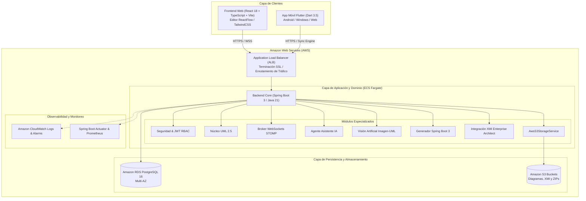

# ARQUITECTURA GENERAL DEL SISTEMA - PLATAFORMA CASE

## Plataforma CASE Colaborativa Inteligente para Diseño UML y Generación Automática de Software

---

## 1. Visión y Principios de Diseño

La **Plataforma CASE** es un ecosistema de ingeniería de software orientado a la automatización del ciclo de desarrollo a partir de modelos conceptuales conformes al estándar **OMG UML 2.5**. La arquitectura sigue los principios fundamentales de la ingeniería de software moderna:

1. **Separación de Responsabilidades (SoC)**: División estricta en capas (Presentación, Dominio, Aplicación, Infraestructura y Persistencia).
2. **Offline-First & Event-Driven**: Los clientes móviles y web pueden operar de manera autónoma y sincronizar estados mediante colas de eventos FIFO y WebSockets STOMP.
3. **Cloud-Native & Contenedorizado**: Despliegue agnóstico e inmutable mediante Docker multi-stage e infraestructura como código (IaC) para **Amazon Web Services (AWS)**.
4. **Inteligencia Aumentada Dual**: Asistencia basada en Large Language Models en la nube (OpenAI GPT-4o-mini / Whisper) y modelos NLP On-Device sin conexión a internet.

---

## 2. Diagrama de Arquitectura Global del Sistema (C4 Container Level)

---

## 3. Desglose de Capas y Tecnologías

### 3.1. Capa de Presentación Web (Frontend)
- **Stack**: React 18.3, TypeScript 5.6, Vite 5.4, TailwindCSS.
- **Lienzo Gráfico**: `ReactFlow 11` con nodos personalizados de clases UML (compartimentos de encabezado, atributos con estereotipos y operaciones).
- **Colaboración**: `@stomp/stompjs` y `sockjs-client` para sincronización de diagramas en tiempo real y presencia de usuarios por avatar.
- **Servidor de Producción**: Nginx 1.27 Alpine con soporte SPA, compresión Gzip y encabezados de seguridad OWASP.

### 3.2. Capa de Aplicación Móvil (Flutter)
- **Stack**: Flutter 3.24.5, Dart 3.5.4.
- **Arquitectura**: Clean Architecture orientada a capas:
  - `core/`: Configuración multi-entorno (`EnvironmentConfig`), cliente HTTP con interceptores JWT (`ApiClient`).
  - `data/local/`: Persistencia relacional local SQLite con DAOs (`ClienteDao`, `ReservaDao`, `ServicioDao`, `SyncQueueDao`, `SyncErrorDao`).
  - `services/`: Motor de sincronización offline con resolución de conflictos *Last-Write-Wins*, modelo de IA On-Device (`OnDeviceModel`) y reconocimiento de voz offline.
  - `providers/`: Gestión reactiva de estado con `Provider`.
  - `screens/`: Vistas de Dashboard, Catálogo, Citas, Asistente IA y Centro de Sincronización.

### 3.3. Capa de Backend y Generación de Software (Spring Boot 3)
- **Stack**: Spring Boot 3.3.4, Java 21 (LTS), Maven 3.9, Hibernate 6 / Spring Data JPA.
- **Seguridad**: Spring Security 6 con JWT sin estado, BCrypt, CORS restrictivo por variables de entorno y validación de beans (`jakarta.validation`).
- **Generador de Código Forward**: Transforma grafos de clases y relaciones UML en código Java 21 compilable mediante plantillas FreeMarker y empaquetador ZIP en memoria.
- **Interoperabilidad XMI**: Parser SAX/DOM bidireccional conforme a OMG XMI 2.1 para integración sin fisuras con Enterprise Architect.
- **Visión por Computador**: Procesamiento visual de diagramas dibujados a mano con detección de geometrías y extracción OCR.

### 3.4. Capa de Almacenamiento y Persistencia (AWS RDS & S3)
- **PostgreSQL 16 en Amazon RDS**: Modelo relacional normalizado con soporte para transacciones ACID, índices optimizados y respaldo automático Multi-AZ.
- **Amazon S3**: Almacenamiento desacoplado para binarios grandes (imágenes de pizarra, exportaciones XMI y proyectos ZIP generados), con cifrado SSE-AES256.

---

## 4. Estrategia de Calidad y Verificación

La plataforma cuenta con una suite integral de **201 pruebas automatizadas** que garantizan la cero regresión y la confiabilidad del sistema:

| Componente | Framework de Testing | Cantidad de Pruebas | Resultado |
| :--- | :--- | :--- | :--- |
| **Backend Spring Boot 3** | JUnit 5, Mockito, SpringBootTest, MockMvc | **115 pruebas** | 100% Exitosas (0 fallos) ✅ |
| **Frontend React 18** | Vitest, React Testing Library, JSDOM | **48 pruebas** | 100% Exitosas (0 fallos) ✅ |
| **Mobile Flutter** | Flutter Test, Mocktail, Fake Async | **38 pruebas** | 100% Exitosas (0 fallos) ✅ |
| **Total Ecosistema** | **Integración Continua (CI/CD)** | **201 pruebas** | **BUILD SUCCESS** ✅ |
