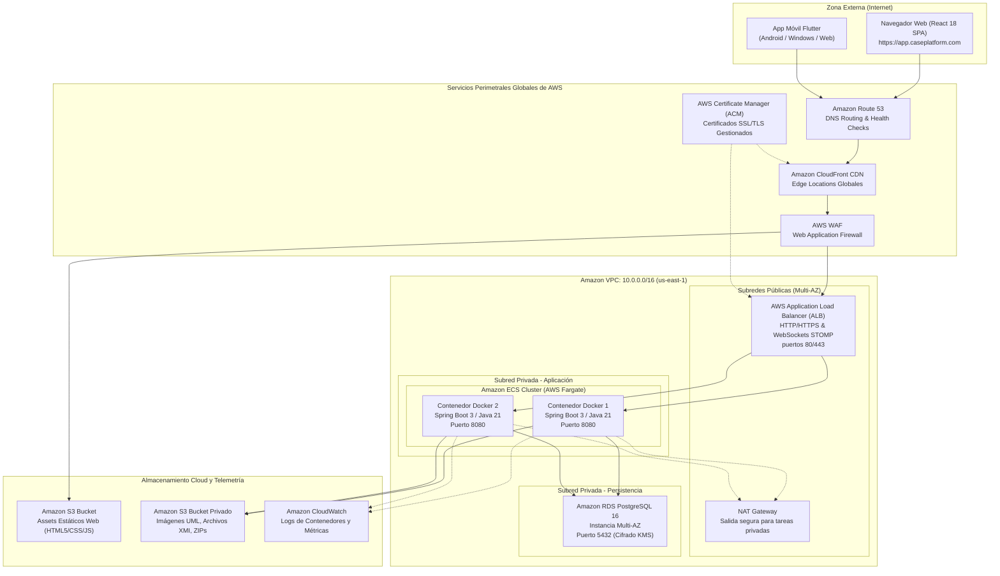
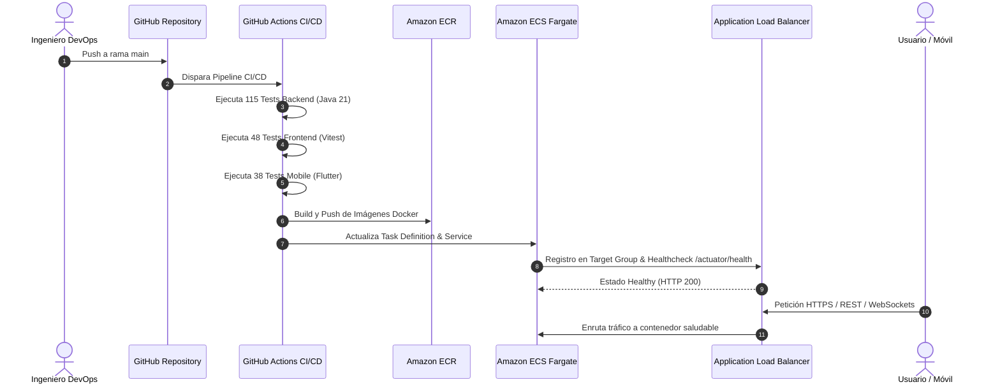

# DIAGRAMAS DE DESPLIEGUE Y ARQUITECTURA CLOUD (AWS)

## Plataforma CASE Inteligente Colaborativa

---

## 1. Diagrama de Despliegue Físico / Cloud (Mermaid)

El siguiente diagrama modela la topología de red, zonas de disponibilidad, servicios gestionados y flujos de tráfico en **Amazon Web Services**:

---

## 2. Diagrama de Secuencia: Despliegue e Interacción en Producción

