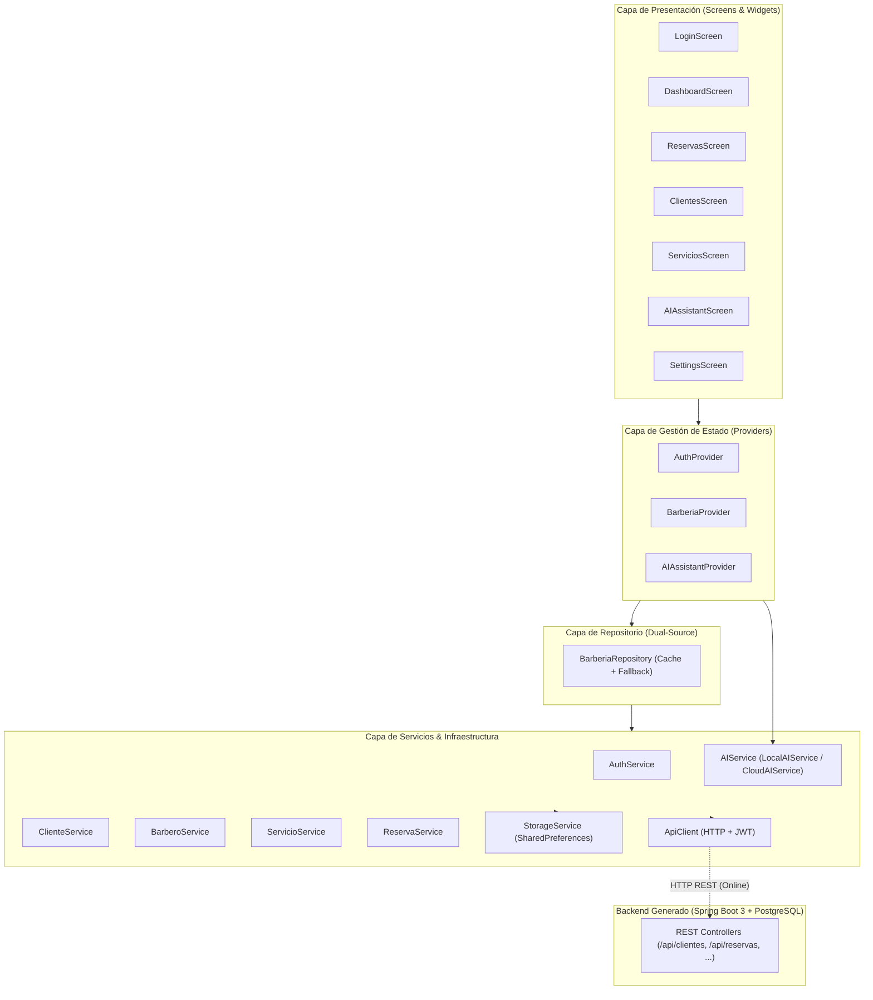
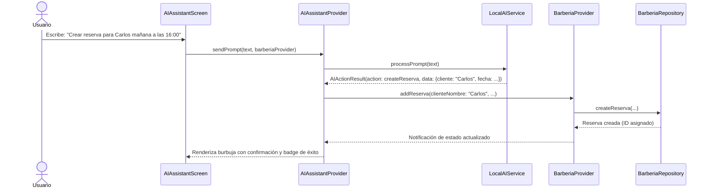

# Documentación de Arquitectura de la Aplicación Móvil Flutter

## 1. Introducción y Propósito

La aplicación móvil Flutter de la Plataforma CASE ha sido diseñada como un cliente móvil multiplataforma (Android, iOS, Web, Desktop) de grado profesional que consume los microservicios y APIs REST generados automáticamente en las Fases 8 y 9 a partir de modelos UML.

Para la demostración completa del flujo de extremo a extremo, la aplicación implementa el dominio de **Gestión de Barbería y Estilismo (BarberShop)**, que incluye las entidades:
- **`Cliente`**: Gestión de clientes, teléfonos, correos y fechas de registro.
- **`Barbero`**: Personal técnico, especialidades (`Fade`, `Navaja`, `Tijera`) y calificaciones.
- **`Servicio`**: Catálogo comercial de servicios, duraciones en minutos y tarifas.
- **`Reserva`**: Citas y turnos agendados con control de estados (`PENDIENTE`, `CONFIRMADA`, `COMPLETADA`, `CANCELADA`).
- **`Pago`**: Registro de cobros, métodos de pago y comprobantes.



---

## 2. Estructura de Capas del Proyecto

El código fuente en `software-case-platform/mobile/lib/` sigue una separación estricta de responsabilidades:

```
software-case-platform/mobile/lib/
├── core/
│   ├── api/
│   │   └── api_client.dart           # Cliente HTTP con JWT, timeouts y mapeo de errores
│   ├── constants/
│   │   ├── api_constants.dart        # Endpoints, URLs base por entorno y timeout
│   │   └── app_colors.dart           # Paleta cromática corporativa (Amber / Slate)
│   └── errors/
│       └── app_exception.dart        # Jerarquía tipada de excepciones (Network, Auth, Server)
├── models/
│   ├── auth_user.dart                # Modelo de usuario autenticado y token JWT
│   ├── barbero.dart                  # Entidad Barbero (especialidad, calificación)
│   ├── cliente.dart                  # Entidad Cliente (contacto, historial)
│   ├── pago.dart                     # Entidad Pago (montos, métodos de pago)
│   ├── reserva.dart                  # Entidad Reserva (estados, fechas, notas)
│   └── servicio.dart                 # Entidad Servicio (catálogo, precios, duración)
├── providers/
│   ├── ai_assistant_provider.dart    # Estado conversacional y ejecución de intenciones IA
│   ├── app_state_provider.dart       # Estado de inicialización y salud del sistema
│   ├── auth_provider.dart            # Ciclo de vida de autenticación y sesión
│   └── barberia_provider.dart        # Estado reactivo del dominio, métricas y caché
├── repositories/
│   └── barberia_repository.dart      # Patrón Dual-Source Repository con tolerancia offline
├── screens/
│   ├── ai_assistant_screen.dart      # Chat conversacional de IA con sugerencias y voz
│   ├── clientes_screen.dart          # Listado, búsqueda y creación de clientes
│   ├── dashboard_screen.dart         # Panel de métricas (ingresos, reservas activas, módulos)
│   ├── login_screen.dart             # Autenticación JWT con credenciales demo
│   ├── reservas_screen.dart          # Gestión de citas, confirmación y cambio de estado
│   ├── servicios_screen.dart         # Catálogo de precios y servicios disponibles
│   └── settings_screen.dart          # Configuración de URL backend, selector IA y offline
├── services/
│   ├── ai/
│   │   ├── ai_service.dart           # Contrato abstracto AIService y DTOs de resultados
│   │   ├── cloud_ai_service.dart     # Conexión con pasarela IA de backend REST
│   │   └── local_ai_service.dart     # Motor NLP on-device determinista (Fase 11/12)
│   ├── auth_service.dart             # Login, registro y cierre de sesión
│   ├── barbero_service.dart          # Cliente REST para /api/barberos
│   ├── cliente_service.dart          # Cliente REST para /api/clientes
│   ├── reserva_service.dart          # Cliente REST para /api/reservas
│   ├── servicio_service.dart         # Cliente REST para /api/servicios
│   └── storage/
│       └── storage_service.dart      # Wrapper de persistencia SharedPreferences
└── widgets/
    ├── ai_message_bubble.dart        # Burbujas de chat estilizadas para usuario e IA
    ├── custom_button.dart            # Botones de acción principal y secundaria
    ├── custom_text_field.dart        # Campos de texto con validación y diseño Material 3
    ├── stat_card.dart                # Tarjetas de métricas estadísticas para el dashboard
    └── status_badge.dart             # Insignias de estado (online/offline, confirmada, etc.)
```

---

## 3. Autenticación y Seguridad JWT

La autenticación utiliza tokens JWT (*JSON Web Tokens*) emitidos por el endpoint `/auth/login` del backend generado:

1. **Persistencia de Sesión**:
   Al autenticarse con éxito, `AuthService` almacena el token JWT y los datos del perfil en `SharedPreferences` mediante `StorageService`.
2. **Inyección en Cabeceras HTTP**:
   `ApiClient` intercepta todas las peticiones salientes e incluye automáticamente el encabezado:
   ```http
   Authorization: Bearer <jwt-token>
   ```
3. **Manejo de Errores de Autenticación**:
   Las respuestas HTTP 401 y 403 son mapeadas a `AuthException`, notificando al `AuthProvider` para invalidar la sesión y redirigir limpiamente a `LoginScreen`.
4. **Modo Demo Rápido**:
   Para demostraciones inmediatas y pruebas offline, el sistema cuenta con credenciales precargadas:
   - **Correo**: `demo@barberia.com`
   - **Contraseña**: `demo123`

---

## 4. Asistente IA Integrado y Preparación para IA Local (Fase 12)

Uno de los requerimientos clave de la Fase 11 es la inclusión de capacidades conversacionales de Inteligencia Artificial que preparen la arquitectura para la ejecución de modelos locales (TFLite / ONNX / LLM cuantizado) en la Fase 12.

### 4.1 Contrato Desacoplado `AIService`

La capa de presentación no interactúa directamente con ninguna biblioteca o backend específico. Se define una interfaz abstracta:

```dart
abstract class AIService {
  Future<AIActionResult> processPrompt(String prompt);
}
```

Donde `AIActionResult` contiene el tipo de intención detectada (`createReserva`, `createCliente`, `listServicios`, `infoGeneral`), los datos estructurados extraídos y el mensaje de respuesta para el usuario.

### 4.2 Motor NLP Heurístico On-Device (`LocalAIService`)

En la Fase 11, `LocalAIService` opera localmente sin requerir conectividad a internet ni incurrir en costos de inferencia en la nube:
- **Reconocimiento de Intenciones**: Analiza frases en lenguaje natural en español (ej. *"Crear una reserva para Carlos mañana a las 16:00"*, *"Registrar cliente Pedro Gómez con teléfono 71234567"*).
- **Extracción de Entidades**: Identifica nombres de personas, fechas relativas (*"mañana"*, *"hoy"*), horas en formato 24h o 12h (*"4 pm"*, *"16:00"*), y servicios solicitados (*"corte clásico"*, *"barba"*).
- **Ejecución de Acciones Reales**: `AIAssistantProvider` recibe la acción y despacha la mutación directamente sobre `BarberiaProvider`, actualizando la base de datos o la memoria local en tiempo real.



### 4.3 Ruta de Evolución hacia la Fase 12

En la Fase 12, se reemplazará la implementación interna de `AIService` por `OnDeviceLlmService` o `TFLiteAIService`. Las pantallas, widgets y proveedores permanecerán **100% inalterados**, garantizando una arquitectura abierta a extensión y cerrada a modificación (Principio Abierto/Cerrado).

---

## 5. Diseño Preparado para Funcionamiento Offline

El patrón `BarberiaRepository` implementa una estrategia de **Dual-Source Repository**:

```
Petición de Datos
       │
       ▼
¿Modo Offline forzado? ─── SÍ ───> Retorna datos de Caché Local
       │ NO
       ▼
Intento Petición HTTP REST
       │
  ┌────┴────────────────────────┐
  │                             │
Éxito (HTTP 200/201)        Fallo de Red (SocketException, 5xx)
  │                             │
  ▼                             ▼
Actualiza Caché Local        Activa flag `isOffline = true`
y retorna datos remotos      Retorna datos de Caché Local con fallback seguro
```

- **Tolerancia Extrema**: Si el servidor Spring Boot no está iniciado o la señal móvil se interrumpe, la aplicación no colapsa ni muestra pantallas en blanco; conmuta inmediatamente a modo offline.
- **Asignación Local de Identificadores**: Los registros creados mientras la aplicación opera desconectada reciben IDs incrementales temporales para mantener la integridad referencial en la interfaz de usuario.
- **Conmutador en Pantalla de Ajustes**: El usuario puede forzar el modo offline de forma manual para pruebas de rendimiento o ahorro de batería desde `SettingsScreen`.

---

## 6. Configuración de Entornos y Conectividad

La pantalla `SettingsScreen` permite configurar dinámicamente la URL base de la API REST generada, guardándola de forma persistente:

| Entorno | URL por Defecto | Caso de Uso |
|---|---|---|
| **Escritorio / Web** | `http://localhost:8080/api` | Pruebas locales con Spring Boot corriendo en el mismo equipo |
| **Emulador Android** | `http://10.0.2.2:8080/api` | Acceso al localhost del host desde el runtime de Android Studio |
| **Dispositivo Físico** | `http://192.168.x.x:8080/api` | Pruebas sobre teléfonos conectados a la misma red WiFi |

---

## 7. Verificación de Pruebas Automatizadas

La aplicación cuenta con una suite completa de pruebas unitarias y de widgets ejecutadas mediante `flutter test`:

```bash
flutter test
```

### Resultados de Ejecución

```
00:14 +19: All tests passed!
```

| Archivo de Prueba | Cobertura / Objetivo | Estado |
|---|---|---|
| `test/models_test.dart` | Serialización/deserialización JSON de todas las entidades (`Cliente`, `Barbero`, `Servicio`, `Reserva`, `Pago`, `AuthUser`) | **100% Aprobado (6/6)** |
| `test/local_ai_service_test.dart` | Motor NLP on-device: extracción de nombres, fechas, turnos, servicios y frases desconocidas | **100% Aprobado (6/6)** |
| `test/barberia_repository_test.dart` | Repositorio dual-source, tolerancia a fallos offline, fallback a caché local y mutaciones CRUD | **100% Aprobado (5/5)** |
| `test/widget_test.dart` | Renderizado de `LoginScreen`, validación de campos, flujo de login demo e ingreso al `DashboardScreen` | **100% Aprobado (2/2)** |
| **Total General** | **19 Pruebas Unitarias y de Integración Móvil** | **19 / 19 Exitosas** |

---

## 8. Conclusión

La Fase 11 queda formalmente concluida y validada. La aplicación móvil Flutter ofrece una experiencia de usuario moderna, reactiva y robusta, consumiendo el backend generado y proveyendo asistencia conversacional inteligente, sentando las bases definitivas para la incorporación de modelos de IA local on-device en la Fase 12.
