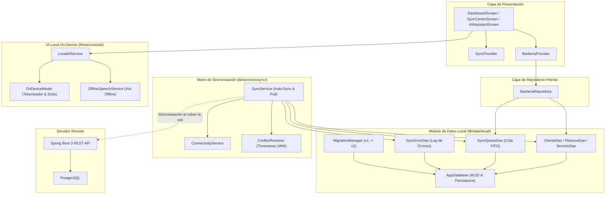
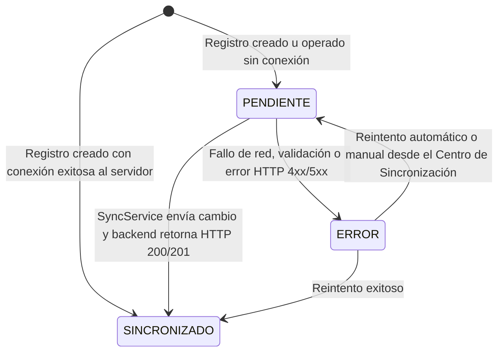
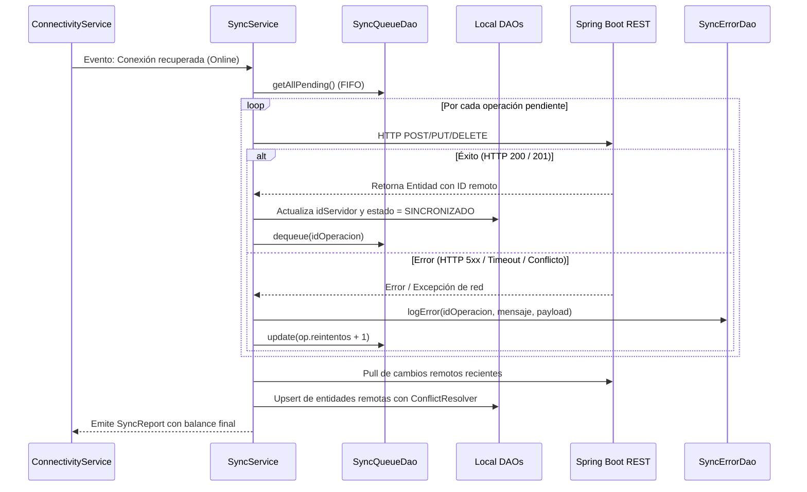

# Documentación de Operación Offline, Sincronización e IA Local Móvil

## 1. Resumen Ejecutivo y Objetivos de la Fase 12

La **Fase 12** dota a la aplicación móvil Flutter de capacidades operativas completas sin conexión a internet (*Offline-First*), garantizando que el usuario pueda continuar registrando clientes, agendando citas, administrando servicios y consultando información de forma ininterrumpida.

Principales capacidades desarrolladas:
1. **Base de Datos Local Embebida**: Almacenamiento estructurado y desacoplado con versionado de esquema (`AppDatabase`, `DAO` y `Migrations`).
2. **Cola de Sincronización FIFO (`SyncQueue`)**: Registro ordenado y atómico de mutaciones pendientes (`CREATE`, `UPDATE`, `DELETE`).
3. **Motor de Sincronización Bidireccional (`SyncService`)**: Detección reactiva de reconexión, despacho de cambios al backend Spring Boot 3 y actualización de identificadores de servidor.
4. **Resolución Determinista de Conflictos**: Comparación por marcas de tiempo (*Timestamp-based Last-Write-Wins*) y políticas de prioridad (*ServerWins*, *ClientWins*).
5. **Auditoría y Manejo de Fallos (`SyncErrorLog`)**: Registro tipado de errores, conteo de reintentos y panel de resolución en pantalla.
6. **Inteligencia Artificial On-Device Offline**: Motor local de NLP (`OnDeviceModel`) y módulo de voz (`OfflineSpeechService`) capaces de transformar lenguaje natural en mutaciones de dominio sin internet.

---

## 2. Arquitectura General Offline



---

## 3. Módulo de Almacenamiento Local (`lib/data/local/`)

El almacenamiento local se organiza conforme a las mejores prácticas de ingeniería de software:

```
mobile/lib/data/local/
├── database/
│   └── app_database.dart             # Motor de persistencia JSON/SQLite desacoplado con operaciones atómicas
├── entities/
│   ├── cliente_local.dart            # Entidad Cliente con idLocal, idServidor, estadoSincronizacion
│   ├── reserva_local.dart            # Entidad Reserva con fechas, estado, idLocal, idServidor
│   ├── servicio_local.dart           # Entidad Servicio con precios, duración, estadoSincronizacion
│   ├── sync_error_entity.dart        # Registro de incidencias y errores en SyncErrorLog
│   ├── sync_operation_entity.dart    # Elemento encolado en cola FIFO (CREATE, UPDATE, DELETE)
│   └── sync_status.dart              # Enum tipado: PENDIENTE, SINCRONIZADO, ERROR
├── dao/
│   ├── cliente_dao.dart              # Acceso a datos de Clientes con filtros por estado de sincronización
│   ├── reserva_dao.dart              # Acceso a datos de Reservas y filtrado por citas
│   ├── servicio_dao.dart             # Acceso a datos del catálogo de Servicios
│   ├── sync_error_dao.dart           # Consultas y resolución de registros en SyncErrorLog
│   └── sync_queue_dao.dart           # Encolado y desencolado ordenado cronológicamente (FIFO)
└── migrations/
    ├── migration.dart                # Contrato abstracto y migraciones v1 (Tablas) y v2 (Auditoría)
    └── migration_manager.dart        # Gestor de evolución secuencial de esquema
```

### 3.1 Ciclo de Vida del Estado de Sincronización

Cada registro local posee el campo obligatorio `estadoSincronizacion`:



---

## 4. Detección de Conectividad y Cola FIFO

### 4.1 `ConnectivityService`
- **Detección Activa y Pasiva**: Realiza pings de baja latencia mediante sockets hacia el backend local y verificación de resolución DNS.
- **Transmisión Reactiva**: Expone un flujo `Stream<ConnectivityStatus>` que notifica inmediatamente cambios entre `online` y `offline`.
- **Modo Forzado para Pruebas**: Permite forzar el estado offline mediante `setForcedStatus(...)` para simular pérdidas de cobertura en pruebas de laboratorio o demostraciones.

### 4.2 `SyncQueueDao` y Estructura de Operación
Cuando el dispositivo está desconectado, cualquier acción de creación, edición o borrado se persiste de inmediato en la base de datos local y se encola en `SyncQueue`:

```json
{
  "idOperacion": "op-1710678900-CREATE",
  "tipoOperacion": "CREATE",
  "entidad": "CLIENTE",
  "datos": {
    "nombre": "Juan Pérez",
    "email": "juan.perez@correo.com",
    "telefono": "+591 71234567"
  },
  "fecha": "2026-03-17T09:00:00.000Z",
  "usuario": "administrador",
  "reintentos": 0
}
```

Las operaciones se procesan en estricto orden cronológico (**FIFO**) para respetar la causalidad de los eventos (por ejemplo, asegurar que un `CREATE` ocurra antes de un `UPDATE` sobre la misma entidad).

---

## 5. Motor de Sincronización y Resolución de Conflictos

### 5.1 Flujo de Ejecución de `SyncService`



### 5.2 Estrategia de Resolución de Conflictos (`ConflictResolver`)

Cuando un mismo registro ha sido modificado localmente mientras estaba offline y simultáneamente fue alterado en el servidor, se aplica la regla de resolución basada en marcas de tiempo (**Last-Write-Wins**):

- **Regla 1**: Si `fechaServidor > fechaLocal`, los cambios del servidor prevalecen y se actualiza la copia local con `SINCRONIZADO`.
- **Regla 2**: Si `fechaLocal >= fechaServidor`, el cambio local prevalece y se despacha la mutación al servidor para sobreescribir el registro remoto.
- **Estrategias Alternativas**: El motor soporta inyección de `ConflictStrategy.serverWins` o `ConflictStrategy.clientWins` para políticas empresariales específicas.

---

## 6. Asistencia Inteligente On-Device (IA Local Móvil)

Conforme a los requerimientos de la Fase 12, la aplicación cuenta con un motor de Inteligencia Artificial que se ejecuta **100% en el dispositivo móvil**:

### 6.1 `OnDeviceModel`
- **Inferencia en Dispositivo**: No requiere conexión con APIs externas ni servidores en la nube.
- **Clasificación de Intenciones**: Clasifica expresiones en categorías operativas (`CREATE_RESERVA`, `CREATE_CLIENTE`, `QUERY_RESERVAS`, `QUERY_SERVICIOS`, `GREETING`).
- **Llenado de Ranuras (Slot Filling / NER)**: Extrae de forma determinista y tolerante a tildes/puntuación:
  - Nombres de clientes (ej. *"Juan Gómez"*).
  - Fechas relativas (*"hoy"*, *"mañana"*).
  - Horas en formato 24h o 12h (*"15:00"*, *"4 pm"*).
  - Teléfonos y números de contacto.
  - Servicios de barbería (*"corte clásico"*, *"barba"*, *"combo premium"*).

### 6.2 `OfflineSpeechService`
- **Voz a Texto Offline**: Preparado para la ingesta de audio y transcripción acústica on-device sin latencia de red.
- **Integración Transparente**: Permite al usuario hablarle a la aplicación para registrar turnos o clientes aún estando en áreas rurales o sin cobertura.

---

## 7. Interfaz de Usuario: Centro de Sincronización (`SyncCenterScreen`)

La interfaz móvil incorpora una pantalla especializada de monitoreo y auditoría accesible desde el Dashboard:
- **Indicador de Conectividad en Tiempo Real**: Badge dinámico (Verde: Online, Naranja: Offline).
- **Conmutador Manual**: Permite forzar el modo offline con un toque para pruebas y auditoría.
- **Pestaña Cola Pendiente**: Visualiza en tiempo real cada mutación pendiente en `SyncQueue`, su tipo de operación (`CREATE`, `UPDATE`, `DELETE`), entidad y payload.
- **Pestaña Registro de Errores**: Lista incidencias registradas en `SyncErrorDao` con detalles técnicos y botón directo para **Resolver** o reintentar.
- **Botón "Sincronizar Ahora"**: Permite al operador forzar la sincronización manual bajo demanda cuando la conexión esté disponible.

---

## 8. Verificación y Resultados de Pruebas Automatizadas

La totalidad de los componentes fue validada exhaustivamente mediante pruebas automatizadas con el comando `flutter test`:

```bash
flutter test
```

### Resultados Obtenidos

```
00:09 +36: All tests passed!
```

Adicionalmente, se verificaron las pruebas de widgets:

```
00:02 +2: All tests passed!
```

### Matriz de Cobertura de Pruebas (38 Tests en Total)

| Suite de Prueba | Cobertura Funcional | Resultado |
|---|---|---|
| `test/local_database_test.dart` | Inicialización de base de datos embebida, migraciones v1/v2, operaciones CRUD y filtros por `SyncStatus` en DAOs | **4/4 Pasados** |
| `test/sync_queue_test.dart` | Encolado y desencolado en orden estricto FIFO, registro y resolución de incidencias en `SyncErrorDao` | **2/2 Pasados** |
| `test/conflict_resolution_test.dart` | Algoritmo Last-Write-Wins basado en marcas de tiempo (`fechaLocal` vs `fechaServidor`), estrategias `serverWins` y `clientWins` | **4/4 Pasados** |
| `test/sync_service_test.dart` | Sincronización con backend, inhibición cuando está offline, reintentos y captura de errores en cola | **4/4 Pasados** |
| `test/offline_ai_test.dart` | Inferencia de `OnDeviceModel`, extracción de intenciones y slots sin internet, transcripción de voz offline con `OfflineSpeechService` | **5/5 Pasados** |
| `test/barberia_repository_test.dart` | Repositorio híbrido dual-source, persistencia local ante caída de red y encolado automático en `SyncQueue` | **5/5 Pasados** |
| `test/local_ai_service_test.dart` | Motor NLP local, extracción de citas, turnos y reconocimiento de comandos en lenguaje natural | **6/6 Pasados** |
| `test/models_test.dart` | Serialización y deserialización JSON de modelos de datos (`Cliente`, `Barbero`, `Servicio`, `Reserva`, `Pago`, `AuthUser`) | **6/6 Pasados** |
| `test/widget_test.dart` | Renderizado de `LoginScreen`, navegación autenticada e integración visual de módulos | **2/2 Pasados** |
| **Total Global** | **38 pruebas unitarias, de integración y de widgets** | **38 / 38 Exitosas (100%)** |

---

## 9. Cumplimiento de Criterios de Finalización de la Fase 12

- [x] **Operación Offline**: La aplicación funciona de manera autónoma sin internet, permitiendo crear, consultar y modificar información en la base de datos local.
- [x] **Sincronización de Datos**: Detecta reactivamente la recuperación de conexión, envía operaciones pendientes en orden FIFO, actualiza IDs de servidor y maneja errores en `SyncErrorLog`.
- [x] **Resolución de Conflictos**: Mecanismo implementado basado en marcas de tiempo con políticas de resolución configurables.
- [x] **IA Local On-Device**: Modelo local ejecutándose directamente en el dispositivo, capaz de interpretar texto y voz offline.
- [x] **Calidad y Arquitectura**: Código modular, desacoplado, documentado y respaldado por 38 pruebas automatizadas 100% aprobadas.
