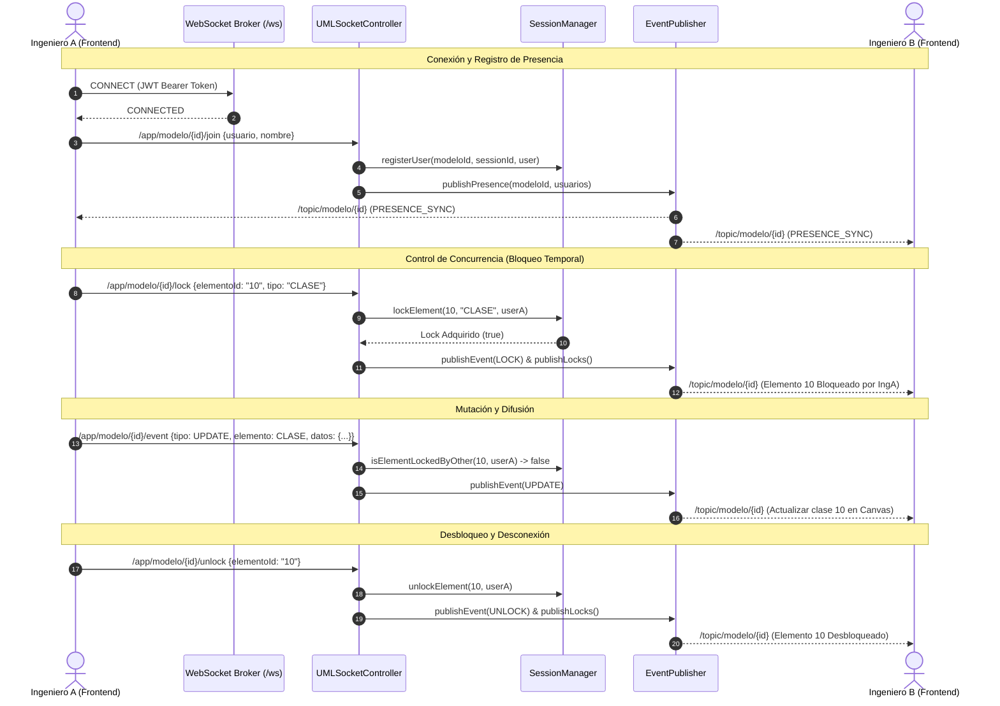

# Arquitectura de Colaboración en Tiempo Real y WebSockets (Fase 5)

## 1. Visión General del Sistema Colaborativo

El módulo de **Colaboración en Tiempo Real** transforma el editor UML individual en una pizarra conceptual compartida de alta concurrencia donde múltiples ingenieros de software pueden diseñar, modificar y refinar simultáneamente un mismo diagrama de clases UML, garantizando la consistencia del modelo y previniendo colisiones de edición concurrentes.

```
                  ┌────────────────────────────────────────────────────────┐
                  │              Broker STOMP (Spring Boot)                │
                  │   Endpoint: /ws (SockJS) | Prefijo App: /app           │
                  │   Tópicos: /topic/modelo/{modeloId}                    │
                  └───────────┬──────────────────────────────┬─────────────┘
                              │                              │
                Difusión Eventos & Presencia   Difusión Eventos & Presencia
                              │                              │
                              ▼                              ▼
                 ┌──────────────────────────┐   ┌──────────────────────────┐
                 │       Ingeniero A        │   │       Ingeniero B        │
                 │   (React Flow + Zustand) │   │   (React Flow + Zustand) │
                 │                          │   │                          │
                 │  ● Bloquea 'Cliente'     │   │  ● Visualiza 'Cliente'   │
                 │  ● Agrega Atributo       │   │    como: 🔒 [Editando A] │
                 │  ● Mueve Posición (x, y) │   │  ● Posición se mueve     │
                 │                          │   │    inmediatamente        │
                 └──────────────────────────┘   └──────────────────────────┘
```

---

## 2. Diagrama de Secuencia: Flujo de Eventos Colaborativos



---

## 3. Componentes del Backend (`com.caseplatform.websocket`)

### 3.1. `WebSocketConfig`
- Configura el broker de mensajería en memoria habilitando destinos de difusión `/topic` y colas privadas `/queue`.
- Expone el endpoint `/ws` con soporte nativo para WebSockets y protocolo fallback **SockJS**.
- Integra `WebSocketAuthInterceptor` en el canal de entrada (`clientInboundChannel`) para autenticar conexiones STOMP antes de procesar cualquier comando.

### 3.2. `WebSocketAuthInterceptor`
- Intercepta frames STOMP `CONNECT`.
- Extrae el token JWT de las cabeceras nativas (`Authorization: Bearer <token>` o `token`).
- Valida la firma criptográfica HMAC-SHA256 y expiración con [`JwtService`](file:///C:/Users/Lin%20Acosta/Documents/SOFTWARE%201/Primer%20parcial%20S/software-case-platform/backend/src/main/java/com/caseplatform/security/JwtService.java).
- Asigna el objeto `Authentication` (`UsernamePasswordAuthenticationToken`) al contexto de seguridad de la sesión WebSocket.

### 3.3. `SessionManager`
- Administra concurrentemente las sesiones activas en memoria (`ConcurrentHashMap`):
  - `modelUsers`: Mapeo de `modeloId -> (username -> UsuarioConectado)`.
  - `modelLocks`: Mapeo de `modeloId -> (elementoId -> BloqueoElemento)`.
  - `sessionMap`: Mapeo de `sessionId -> SessionInfo`.
- Asigna automáticamente colores distinguibles a cada usuario conectado para visualización gráfica en el editor.
- Implementa control de concurrencia: si el elemento ya está en posesión de otro usuario, las solicitudes de bloqueo o modificación son rechazadas.

### 3.4. `UMLSocketController`
- `@MessageMapping("/modelo/{modeloId}/join")`: Procesa el ingreso del usuario y difunde eventos de presencia.
- `@MessageMapping("/modelo/{modeloId}/leave")`: Procesa la salida voluntaria, libera bloqueos y actualiza presencia.
- `@MessageMapping("/modelo/{modeloId}/lock")`: Adquiere el bloqueo exclusivo temporal de un elemento UML.
- `@MessageMapping("/modelo/{modeloId}/unlock")`: Libera el bloqueo de un elemento.
- `@MessageMapping("/modelo/{modeloId}/event")`: Valida permisos de bloqueo y retransmite eventos atómicos de mutación (`CREATE`, `UPDATE`, `DELETE`).

### 3.5. `WebSocketEventListener`
- Escucha `SessionDisconnectEvent` emitido por el contenedor Spring.
- Detecta desconexiones imprevistas o cierres de pestaña.
- Libera inmediatamente todos los bloqueos retenidos por el usuario desconectado y notifica a los demás ingenieros conectados al mismo modelo para garantizar que ningún elemento quede bloqueado indefinidamente.

---

## 4. Integración en el Frontend (`frontend/src/features/uml-editor`)

### 4.1. `websocketService.ts`
- Implementado con `@stomp/stompjs` y `sockjs-client`.
- Gestiona el ciclo de vida de la conexión:
  - Inyección de cabeceras JWT en el frame `CONNECT`.
  - Reconexión automática con retardo exponencial configurable.
  - Suscripción al tópico `/topic/modelo/{modeloId}`.
  - Métodos utilitarios: `sendEvent`, `sendJoin`, `sendLeave`, `lockElement`, `unlockElement`.

### 4.2. `umlStore.ts` (Zustand)
- **Estado Colaborativo**:
  - `connectedUsers`: Lista reactiva de ingenieros en línea con nombres y colores.
  - `lockedElements`: Lista de bloqueos de concurrencia vigentes.
  - `isWsConnected`: Estado booleano de la conexión en vivo.
- **Acción `applyRemoteEvent`**:
  - Aplica mutaciones remotas entrantes sin re-difundirlas localmente (prevención de bucles de eco).
  - Actualiza el grafo visual de React Flow (`nodes` y `edges`) y el modelo conceptual.
- **Transmisión de Coordenadas**:
  - Al soltar un nodo arrastrado (`handleNodeDragStop`), se invoca `broadcastNodePosition(claseId, x, y)`.

### 4.3. Experiencia Visual de Usuario
1. **Barra Superior (`Toolbar.tsx`)**:
   - Indicador de estado en vivo con punto verde/rojo (`🟢 En Vivo` / `🔴 Desconectado`).
   - Círculos de avatar para cada usuario conectado con su color asignado por el servidor y tooltip de nombre.
   - Contador de participantes: `👥 X en línea`.
2. **Nodos de Clase (`ClassNode.tsx`)**:
   - Si una clase está bloqueada por otro usuario:
     - Borde rojo distintivo con resplandor (`locked-by-other`).
     - Badge en la cabecera: `🔒 [Nombre de Usuario]`.
   - Si la clase está siendo editada por el usuario actual:
     - Borde azul (`locked-by-self`).
     - Badge: `✏️ Editando`.
3. **Panel de Propiedades (`PropertiesPanel.tsx`)**:
   - Banner de advertencia si la clase seleccionada está bloqueada por otro usuario.
   - Campos de texto, selectores de visibilidad y botones de adición/eliminación deshabilitados (`disabled={isLockedByOther}`).

---

## 5. Pruebas y Validación de Calidad

- **Backend (34 pruebas unitarias e integración en verde)**:
  - [`SessionManagerTest`](file:///C:/Users/Lin%20Acosta/Documents/SOFTWARE%201/Primer%20parcial%20S/software-case-platform/backend/src/test/java/com/caseplatform/SessionManagerTest.java): Prueba presencia de usuarios, adquisición de bloqueos, detección de colisiones y liberación por desconexión.
  - [`UMLSocketControllerTest`](file:///C:/Users/Lin%20Acosta/Documents/SOFTWARE%201/Primer%20parcial%20S/software-case-platform/backend/src/test/java/com/caseplatform/UMLSocketControllerTest.java): Prueba eventos STOMP de join, leave, lock, rechazo de eventos conflictivos y retransmisión.
- **Frontend (11 pruebas en verde con Vitest)**:
  - [`collaboration.test.ts`](file:///C:/Users/Lin%20Acosta/Documents/SOFTWARE%201/Primer%20parcial%20S/software-case-platform/frontend/src/features/uml-editor/__tests__/collaboration.test.ts): Valida la integración de presencia, sincronización de bloqueos, y la aplicación de eventos remotos `CREATE`, `UPDATE` y `DELETE`.
  - [`ClassNode.test.tsx`](file:///C:/Users/Lin%20Acosta/Documents/SOFTWARE%201/Primer%20parcial%20S/software-case-platform/frontend/src/features/uml-editor/__tests__/ClassNode.test.tsx): Valida renderizado y compartimientos UML.
- **Compilación de Producción**:
  - `npm run build` (`tsc && vite build`) exitoso con 0 errores.
