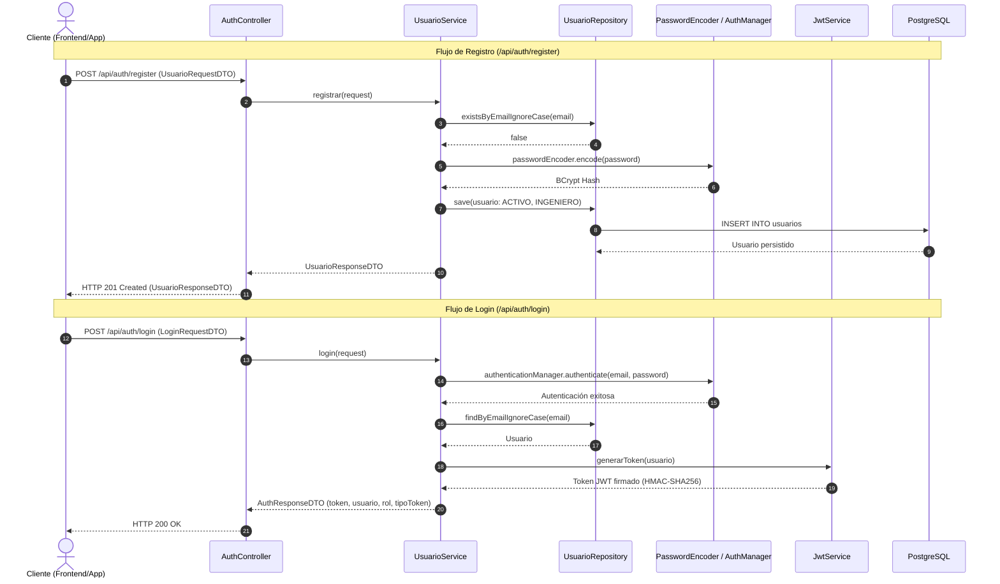
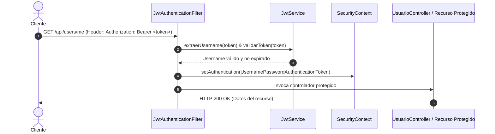

# Arquitectura de Seguridad y Sistema de Usuarios (Fase 2)

## 1. Visión General de la Arquitectura de Seguridad

El módulo de identidad y seguridad de la **Plataforma CASE Colaborativa Inteligente** implementa una arquitectura desacoplada, sin estado (*Stateless*), basada en **Spring Security 6**, **Spring Boot 3**, **Java 21**, **PostgreSQL** y autenticación mediante **JSON Web Tokens (JWT)** con algoritmo HMAC-SHA256 (JJWT 0.12.6).

```
   Cliente Web / Móvil / Swagger
                 │
                 ▼
       [CorsConfigurationSource]
                 │
                 ▼
   [JwtAuthenticationFilter (OncePerRequest)] ───> [JwtService] (Verifica firma y expiración)
                 │                                        ▲
                 │ (Carga Usuario por Email)              │
                 ▼                                        │
     [UserDetailsServiceImpl] ────────────────────────────┘
                 │
                 ▼
   [SecurityContextHolder] (Establece UsernamePasswordAuthenticationToken)
                 │
                 ▼
    [AuthorizeHttpRequests Filter Chain]
    ├── Públicos: /api/auth/**, /api/v1/health, etc.
    ├── Protegidos RBAC: /api/users/** (ROLE_ADMIN)
    └── Protegidos Autenticados: /api/users/me, /api/projects/**, /api/models/**
                 │
                 ├── [JwtAuthenticationEntryPoint] (401 Unauthorized si falta token)
                 └── [JwtAccessDeniedHandler]     (403 Forbidden si rol insuficiente)
```

---

## 2. Flujo de Autenticación JWT

### Registro e Inicio de Sesión


### Peticiones Protegidas con Token


---

## 3. Modelo de Roles y Permisos (RBAC)

El sistema define dos roles principales con separación estricta de responsabilidades:

| Rol | Descripción | Permisos asignados |
| :--- | :--- | :--- |
| **`ADMIN`** | Administrador de la plataforma | - Gestión completa de usuarios (`GET`, `PUT`, `PATCH`, `DELETE` en `/api/users/**`)<br>- Asignación de roles y estados de cuenta<br>- Configuración global de la plataforma<br>- Auditoría y control de acceso |
| **`INGENIERO`** | Ingeniero de software / Diseñador UML | - Acceso a perfil propio (`GET /api/users/me`)<br>- Creación y gestión de proyectos (`/api/projects/**`)<br>- Modelado y diseño de diagramas UML (`/api/models/**`)<br>- Uso de herramientas colaborativas y asistentes de IA |

---

## 4. Matriz de Endpoints y Seguridad

### Endpoints Públicos
| Método | Ruta | Descripción | Request DTO | Response DTO |
| :--- | :--- | :--- | :--- | :--- |
| `POST` | `/api/auth/register` | Registro de nuevos usuarios | `UsuarioRequestDTO` | `UsuarioResponseDTO` (HTTP 201) |
| `POST` | `/api/auth/login` | Inicio de sesión y emisión de JWT | `LoginRequestDTO` | `AuthResponseDTO` (HTTP 200) |
| `GET` | `/api/v1/health` | Health check del sistema y DB | Ninguno | `HealthResponseDto` (HTTP 200) |
| `GET` | `/api/v1/ping` | Verificación de disponibilidad | Ninguno | `ApiResponse<String>` (HTTP 200) |

### Endpoints Protegidos
| Método | Ruta | Permiso Requerido | Descripción |
| :--- | :--- | :--- | :--- |
| `GET` | `/api/users/me` | Autenticado | Retorna el perfil del usuario autenticado |
| `GET` | `/api/users` | `ROLE_ADMIN` | Lista todos los usuarios del sistema |
| `GET` | `/api/users/{id}` | Autenticado | Obtiene el detalle de un usuario por ID |
| `PUT` | `/api/users/{id}` | `ROLE_ADMIN` | Actualiza información del usuario |
| `PATCH` | `/api/users/{id}/estado` | `ROLE_ADMIN` | Cambia estado (`ACTIVO`, `INACTIVO`, `BLOQUEADO`) |
| `DELETE` | `/api/users/{id}` | `ROLE_ADMIN` | Elimina un usuario |
| `GET` | `/api/projects/**` | Autenticado | Acceso a gestión de proyectos UML |
| `GET` | `/api/models/**` | Autenticado | Acceso a modelos y diagramas UML |

---

## 5. Manejo de Errores y Excepciones

El módulo estandariza las respuestas de error mediante `GlobalExceptionHandler`, `JwtAuthenticationEntryPoint` y `JwtAccessDeniedHandler`:

```json
{
  "status": 400,
  "error": "Bad Request",
  "message": "El correo electrónico ya se encuentra registrado: usuario@caseplatform.com",
  "path": "/api/auth/register",
  "timestamp": "2026-09-15T14:30:00"
}
```

- **HTTP 401 Unauthorized**: Peticiones a rutas protegidas sin encabezado `Authorization: Bearer <token>` o con token inválido/expirado.
- **HTTP 403 Forbidden**: Peticiones válidas autenticadas pero con rol insuficiente (ej. usuario `INGENIERO` intentando acceder a `GET /api/users`).
- **HTTP 400 Bad Request**: Errores de validación de formulario (`@Valid`) o unicidad de email duplicado (`ValidationException`).
- **HTTP 404 Not Found**: Usuario o recurso inexistente (`ResourceNotFoundException`).

---

## 6. Configuración de Base de Datos

Tabla `usuarios` creada en `database/init.sql`:

```sql
CREATE TABLE IF NOT EXISTS usuarios (
    id BIGSERIAL PRIMARY KEY,
    nombre_completo VARCHAR(150) NOT NULL,
    email VARCHAR(150) NOT NULL UNIQUE,
    password VARCHAR(255) NOT NULL,
    rol VARCHAR(30) NOT NULL CHECK (rol IN ('ADMIN', 'INGENIERO')),
    estado VARCHAR(30) NOT NULL DEFAULT 'ACTIVO' CHECK (estado IN ('ACTIVO', 'INACTIVO', 'BLOQUEADO')),
    fecha_creacion TIMESTAMP WITHOUT TIME ZONE NOT NULL DEFAULT CURRENT_TIMESTAMP,
    fecha_actualizacion TIMESTAMP WITHOUT TIME ZONE
);

CREATE INDEX idx_usuarios_email ON usuarios(email);
CREATE INDEX idx_usuarios_rol ON usuarios(rol);
CREATE INDEX idx_usuarios_estado ON usuarios(estado);
```
