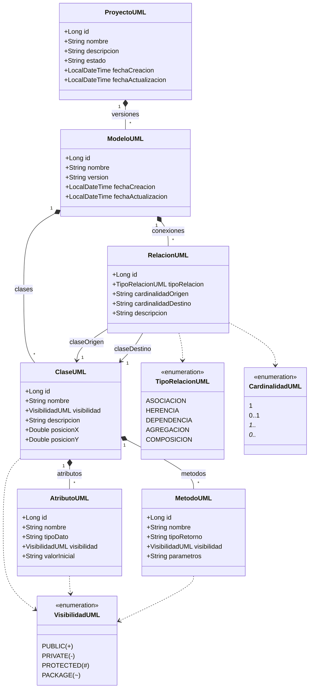

# Núcleo UML 2.5 y Modelo Conceptual del Sistema (Fase 3)

## 1. Visión General del Núcleo UML

El módulo **Núcleo UML 2.5** es el motor central de modelado conceptual de la **Plataforma CASE Colaborativa Inteligente**. Proporciona una estructura de datos robusta, validada y persistente para representar diagramas de clases UML, sirviendo de base para los módulos de pizarra visual, colaboración en tiempo real, asistente IA y generación de código Spring Boot.

```
                  ┌──────────────┐
                  │  Usuario     │
                  └──────┬───────┘
                         │ 1
                         │ posee
                         ▼ *
                  ┌──────────────┐
                  │ ProyectoUML  │
                  └──────┬───────┘
                         │ 1
                         │ contiene
                         ▼ *
                  ┌──────────────┐
                  │  ModeloUML   │ (Versión de Diagrama)
                  └──────┬───────┘
                         │
          ┌──────────────┴──────────────┐
          │ 1                           │ 1
          │ contiene                    │ contiene
          ▼ *                           ▼ *
   ┌──────────────┐              ┌──────────────┐
   │   ClaseUML   │◄─────────────┤ RelacionUML  │ (Origen/Destino)
   └──────┬───────┘ 1          * └──────────────┘
          │
    ┌─────┴────────────────┐
    │ 1                    │ 1
    ▼ *                    ▼ *
┌─────────────┐      ┌─────────────┐
│ AtributoUML │      │  MetodoUML  │
└─────────────┘      └─────────────┘
```

---

## 2. Diagrama de Clases del Dominio UML



---

## 3. Tipos y Cardinalidades Soportadas

### Tipos de Relaciones UML
1. **Asociación (`ASOCIACION`)**: Conexión estructural estándar entre clases independientes (ej. `Cliente 1 ---- * Pedido`).
2. **Herencia (`HERENCIA`)**: Relación de generalización/especialización (ej. `Empleado <|---- Gerente`). No permite autorreferencia reflexiva.
3. **Dependencia (`DEPENDENCIA`)**: Relación de uso débil donde una clase requiere de otra para operar (ej. `Factura ..> Impresora`).
4. **Agregación (`AGREGACION`)**: Relación todo-parte débil ("posee un"). El componente puede existir independientemente del contenedor.
5. **Composición (`COMPOSICION`)**: Relación todo-parte fuerte ("consiste en"). El ciclo de vida del componente depende del contenedor.

### Cardinalidades UML Válidas
- **`1`**: Exactamente uno.
- **`0..1`**: Cero o uno (opcional).
- **`*`**: Cero a muchos.
- **`1..*`**: Uno a muchos.
- **`0..*`**: Cero a muchos (equivalente a `*`).

### Tipos de Datos para Atributos
Soporta tipos primitivos/envolturas estándar de Java y tipos personalizados:
- `String`
- `Integer`
- `Long`
- `Double`
- `Boolean`
- `Date`
- `Custom` (referencias a otras clases conceptuales)

---

## 4. Reglas del Dominio y Validaciones

1. **Unicidad de Clases**: No se permiten clases duplicadas con el mismo nombre dentro de una misma versión de modelo UML (`existsByModeloUMLIdAndNombreIgnoreCase`).
2. **Nombres Obligatorios**: Ni proyectos, modelos, clases, atributos ni métodos pueden crearse con nombres vacíos o nulos.
3. **Consistencia de Modelo en Relaciones**: Las clases origen y destino de una relación deben existir y pertenecer estrictamente al **mismo modelo UML**.
4. **Prevención de Ciclos Reflexivos**: En relaciones de herencia (`HERENCIA`), una clase no puede tenerse a sí misma como destino de herencia.
5. **Integridad Referencial y Cascada**: Al eliminar un proyecto, se eliminan en cascada sus modelos. Al eliminar una clase, se eliminan sus atributos, métodos y todas las relaciones donde participe como origen o destino.

---

## 5. Catálogo de APIs REST (Núcleo UML)

Todas las rutas requieren autenticación con token JWT en el encabezado `Authorization: Bearer <token>`.

### Proyectos
- `POST /api/proyectos`: Crea un nuevo proyecto e inicializa automáticamente un modelo versión 1.0.
- `GET /api/proyectos`: Lista los proyectos del usuario autenticado.
- `GET /api/proyectos/{id}`: Obtiene el detalle de un proyecto y sus modelos asociados.
- `PUT /api/proyectos/{id}`: Actualiza metadatos del proyecto.
- `DELETE /api/proyectos/{id}`: Elimina el proyecto y su contenido.

### Modelos
- `POST /api/proyectos/{proyectoId}/modelos`: Crea una nueva versión del diagrama dentro del proyecto.
- `GET /api/proyectos/{proyectoId}/modelos`: Lista las versiones del modelo.
- `GET /api/modelos/{id}`: Retorna el diagrama conceptual completo con clases, atributos, métodos y relaciones.
- `DELETE /api/modelos/{id}`: Elimina la versión del modelo.

### Clases
- `POST /api/modelos/{id}/clases`: Agrega una clase a la pizarra del modelo con coordenadas X e Y.
- `GET /api/modelos/{id}/clases`: Lista las clases de un modelo.
- `GET /api/clases/{id}`: Obtiene el detalle de una clase.
- `PUT /api/clases/{id}`: Actualiza nombre, visibilidad, posición o descripción de la clase.
- `DELETE /api/clases/{id}`: Elimina la clase y desconecta sus relaciones.

### Atributos y Métodos
- `POST /api/clases/{id}/atributos`: Agrega un atributo con nombre, tipo de dato y visibilidad.
- `GET /api/clases/{id}/atributos`: Lista los atributos de una clase.
- `DELETE /api/atributos/{id}`: Elimina un atributo.
- `POST /api/clases/{id}/metodos`: Agrega un método con firma, tipo de retorno y visibilidad.
- `GET /api/clases/{id}/metodos`: Lista los métodos de una clase.
- `DELETE /api/metodos/{id}`: Elimina un método.

### Relaciones
- `POST /api/relaciones`: Establece una relación entre dos clases especificando tipo y cardinalidades.
- `GET /api/modelos/{id}/relaciones`: Lista las relaciones activas del modelo.
- `GET /api/relaciones/{id}`: Obtiene el detalle de una relación.
- `DELETE /api/relaciones/{id}`: Elimina la relación.
