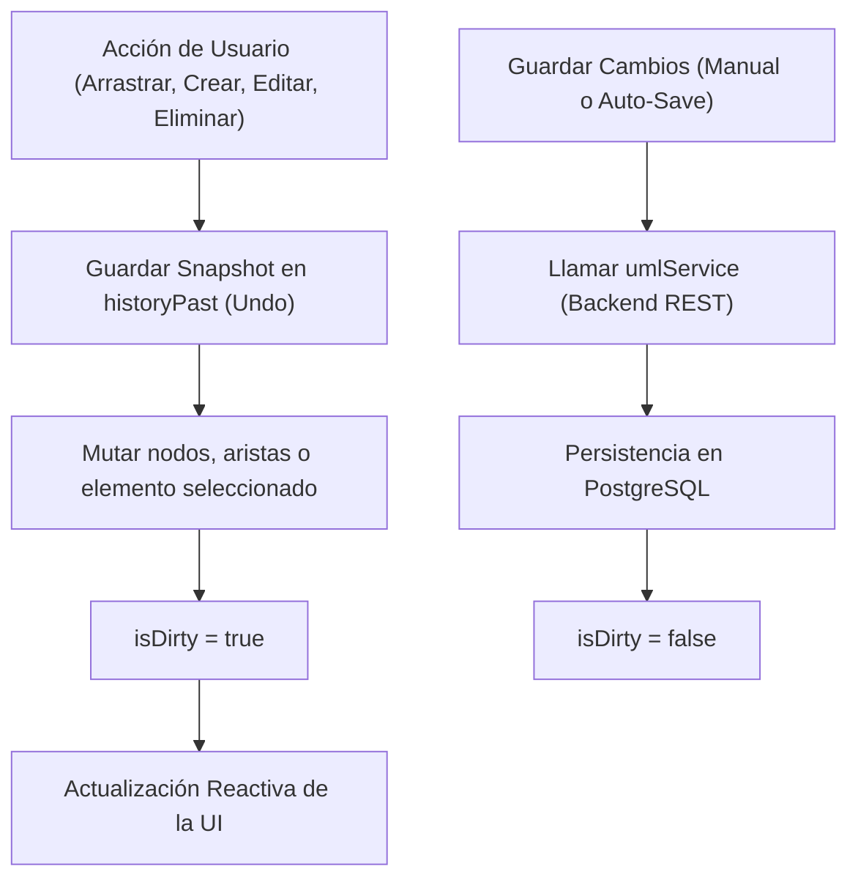

# Arquitectura del Editor Visual UML 2.5 (Fase 4)

## 1. Visión General del Editor Visual

El módulo **Editor Visual UML 2.5** proporciona una pizarra colaborativa e interactiva en el frontend web desarrollada con **React 18**, **TypeScript**, **React Flow** (`reactflow`) y **Zustand**. Permite a los arquitectos e ingenieros modelar diagramas de clases UML completos de forma gráfica, intuitiva y en tiempo real, integrándose directamente con el backend Spring Boot y la base de datos PostgreSQL desarrollados en las fases anteriores.

```
┌─────────────────────────────────────────────────────────────────────────┐
│                           Editor Visual UML                             │
│                                                                         │
│  ┌────────────────────────┐  ┌───────────────────────────────────────┐  │
│  │       Toolbar          │  │           PropertiesPanel             │  │
│  │ (Agregar clase/relac., │  │ (Edición de atributos, métodos,       │  │
│  │  undo/redo, guardar)   │  │  visibilidad, cardinalidades)         │  │
│  └───────────┬────────────┘  └──────────────────┬────────────────────┘  │
│              │                                  │                       │
│              ▼                                  ▼                       │
│  ┌───────────────────────────────────────────────────────────────────┐  │
│  │                    UMLCanvas (React Flow)                         │  │
│  │  ┌──────────────────────┐              ┌──────────────────────┐   │  │
│  │  │   ClassNode (UML)    │◄────────────►│   ClassNode (UML)    │   │  │
│  │  │  - Visibilidad       │  Relaciones  │  - Visibilidad       │   │  │
│  │  │  - Atributos         │  (Herencia,  │  - Atributos         │   │  │
│  │  │  - Métodos           │   Asoc, etc) │  - Métodos           │   │  │
│  │  └──────────────────────┘              └──────────────────────┘   │  │
│  └──────────────────────────────────┬────────────────────────────────┘  │
│                                     │                                   │
└─────────────────────────────────────┼───────────────────────────────────┘
                                      │
                                      ▼
                        ┌───────────────────────────┐
                        │   Zustand UML Store       │
                        │   (Historial Undo/Redo,   │
                        │    Nodos, Aristas, Sync)  │
                        └─────────────┬─────────────┘
                                      │ Axios + JWT
                                      ▼
                        ┌───────────────────────────┐
                        │    Backend Spring Boot    │
                        │   (REST Controllers UML)  │
                        └───────────────────────────┘
```

---

## 2. Jerarquía de Componentes Frontend

La estructura del código sigue el patrón modular por funcionalidades (*feature-sliced*):

```
frontend/src/
├── features/
│   └── uml-editor/
│       ├── components/
│       │   ├── ClassNode.tsx            # Nodo personalizado de React Flow para clase UML
│       │   ├── UMLCanvas.tsx            # Lienzo React Flow con controles y minimapa
│       │   ├── Toolbar.tsx              # Barra de herramientas superior
│       │   ├── PropertiesPanel.tsx      # Panel lateral de propiedades del elemento seleccionado
│       │   ├── CreateClassModal.tsx     # Modal interactivo de creación de clases
│       │   └── CreateRelationModal.tsx  # Modal interactivo de creación de relaciones
│       ├── models/
│       │   └── uml.types.ts             # Definiciones TypeScript completas del dominio UML
│       ├── services/
│       │   └── umlService.ts            # Cliente HTTP Axios hacia /api/** del backend
│       ├── store/
│       │   └── umlStore.ts              # Store Zustand con soporte Undo/Redo y sincronización
│       ├── styles/
│       │   └── uml-editor.css           # Estilos temáticos CSS para tarjetas UML, conectores y paneles
│       └── __tests__/
│           ├── ClassNode.test.tsx       # Pruebas unitarias de renderizado y compartimientos UML
│           └── umlStore.test.ts         # Pruebas del store de estado (agregar clases, selección, etc.)
├── pages/
│   ├── LoginPage.tsx                    # Página de autenticación con JWT
│   ├── ProjectsPage.tsx                 # Selector y creador de proyectos
│   └── UMLEditorPage.tsx                # Página contenedora del editor y atajos de teclado
├── routes/
│   └── index.tsx                        # Rutas públicas y protegidas mediante ProtectedRoute
└── services/
    ├── api.ts                           # Instancia base de Axios con interceptor JWT
    └── authService.ts                   # Servicio de login, registro y almacenamiento de token
```

---

## 3. Representación Gráfica UML 2.5 (`ClassNode`)

El componente [`ClassNode`](file:///frontend/src/features/uml-editor/components/ClassNode.tsx) implementa fielmente la especificación gráfica de clases UML 2.5:

1. **Cabecera de la Clase**:
   - Nombre en negrita centrado.
   - Símbolo de visibilidad de la clase (`+`, `-`, `#`, `~`).
   - Distinción visual para clases abstractas o interfaces si aplica.
2. **Compartimiento de Atributos**:
   - Formato estándar: `{visibilidad} {nombre}: {tipoDato}` (ej. `+ id: Long`, `- email: String`).
3. **Compartimiento de Métodos**:
   - Formato estándar: `{visibilidad} {nombre}({parametros}): {tipoRetorno}` (ej. `+ calcularTotal(descuento: Double): Double`).
4. **Puertos de Conexión (Handles)**:
   - 4 conectores ortogonales (`Top`, `Right`, `Bottom`, `Left`) con doble rol (*source* y *target*) para conectar aristas entre clases.
5. **Simbolismo de Visibilidad**:
   - `+` : `PUBLIC`
   - `-` : `PRIVATE`
   - `#` : `PROTECTED`
   - `~` : `PACKAGE`

---

## 4. Tipos de Relaciones Soportadas en el Canvas

Las relaciones se representan mediante aristas de React Flow con marcadores visuales estándar:

| Tipo UML | Representación Visual | Marcador / Extremo | Semántica |
| :--- | :--- | :--- | :--- |
| **`ASOCIACION`** | Línea continua | Flecha simple abierta | Conexión estructural |
| **`HERENCIA`** | Línea continua | Triángulo cerrado hueco | Generalización / Subclase |
| **`AGREGACION`** | Línea continua | Rombo hueco | Todo-parte débil |
| **`COMPOSICION`** | Línea continua | Rombo relleno | Todo-parte fuerte (ciclo de vida ligado) |
| **`DEPENDENCIA`** | Línea punteada | Flecha simple abierta | Dependencia de uso |

Las etiquetas de las aristas muestran las cardinalidades seleccionadas en origen y destino (`1`, `0..1`, `*`, `1..*`, `0..*`).

---

## 5. Gestión del Estado con Zustand (`umlStore`)

El store centralizado administra el estado reactivo del canvas sin sobrecargar componentes hijos:



### Funcionalidades de Estado Soportadas
- **Undo / Redo**: Registro de estados pasados (`historyPast`) y futuros (`historyFuture`) limitados a los últimos 30 snapshots para optimizar consumo de memoria.
- **Detección de Cambios (`isDirty`)**: Indicador de cambios sin persistir en el servidor.
- **Sincronización Bidireccional de Coordenadas**: Las posiciones `(x, y)` calculadas por React Flow se transforman a `posicionX` y `posicionY` del backend al guardar.
- **Selección de Elementos**: Permite seleccionar una clase o relación para abrir sus propiedades detalladas en el `PropertiesPanel`.

---

## 6. Atajos de Teclado y Experiencia de Usuario

El editor soporta controles estándar para agilizar el flujo de diseño:

- **`CTRL + Z`**: Deshacer última modificación visual o de contenido.
- **`CTRL + Y`** o **`CTRL + Shift + Z`**: Rehacer cambio revertido.
- **`DELETE`** / **`BACKSPACE`**: Eliminar clase seleccionada o relación activa (con confirmación de seguridad).
- **Minimapa y Controles**: Navegación por panorámica (*pan*), zoom interactivo con rueda de ratón o botones, centrado automático del diagrama (*Fit View*).

---

## 7. Integración con Backend y Seguridad

1. **Tokens JWT**: `api.ts` inyecta automáticamente el encabezado `Authorization: Bearer <token>` almacenado en `localStorage`.
2. **Protección de Rutas**: `ProtectedRoute` redirige a `/login` si no existe sesión válida.
3. **Mapeo de Endpoints**:
   - `GET /api/modelos/{id}`: Carga el grafo conceptual completo.
   - `POST /api/modelos/{id}/clases`: Creación de clase con coordenadas iniciales.
   - `PUT /api/clases/{id}`: Actualización de nombre y coordenadas.
   - `DELETE /api/clases/{id}`: Eliminación de clase en base de datos.
   - `POST /api/clases/{id}/atributos`: Creación de atributo tipado.
   - `DELETE /api/atributos/{id}`: Eliminación de atributo.
   - `POST /api/clases/{id}/metodos`: Creación de método con firma y retorno.
   - `DELETE /api/metodos/{id}`: Eliminación de método.
   - `POST /api/relaciones`: Creación de arista con tipo y cardinalidades.
   - `DELETE /api/relaciones/{id}`: Eliminación de relación.

---

## 8. Verificación de Calidad y Pruebas

- **TypeScript Strict Mode**: Verificado con `npm run build` (`tsc -b && vite build`) sin errores de tipos.
- **Vitest & React Testing Library**:
  - `ClassNode.test.tsx`: Verifica la visualización del nombre de la clase, visibilidad `+`, y los compartimientos de atributos y métodos.
  - `umlStore.test.ts`: Valida mutaciones de clases, relaciones, selección y comportamiento de undo.
