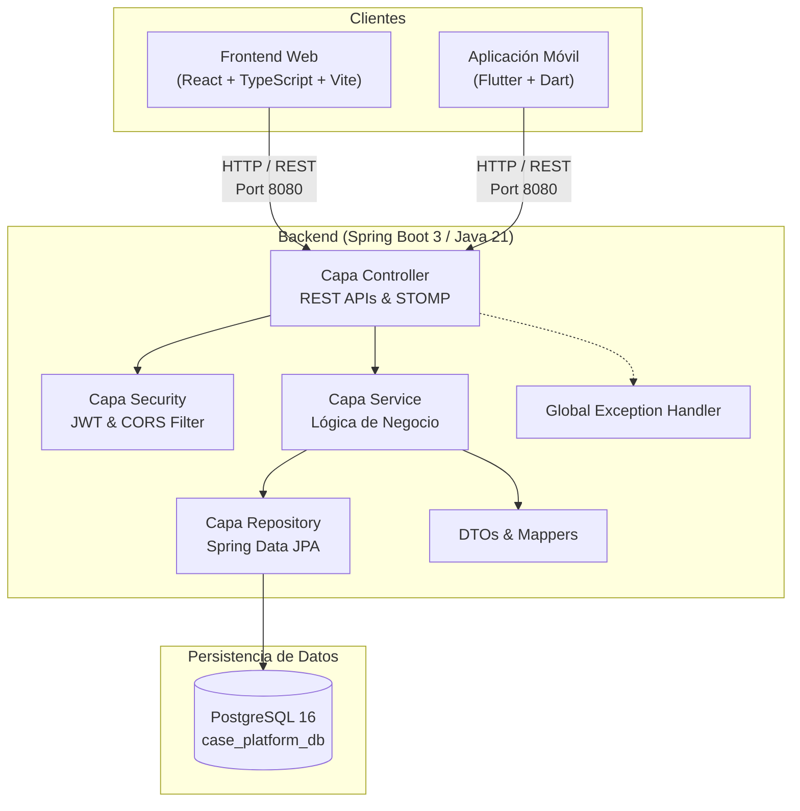

# Diagrama de Arquitectura Inicial - CASE Platform

### Flujo de Peticiones
1. Los clientes (Web o Móvil) despachan solicitudes HTTP seguras al API Gateway/Backend en `http://localhost:8080/api/v1/...`.
2. La capa **Security** valida credenciales, cabeceras CORS y tokens JWT.
3. La capa **Controller** procesa y mapea la solicitud delegando en la interfaz **Service**.
4. La capa **Service** aplica lógica de negocio y se comunica con la capa **Repository**.
5. La capa **Repository** interactúa con **PostgreSQL** mediante Hibernate / JDBC HikariCP.
6. La respuesta se retorna empaquetada en un `ApiResponse<T>` estandarizado. Si ocurre una excepción, `GlobalExceptionHandler` captura y unifica el formato del error.
